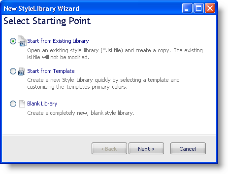

////

|metadata|
{
    "name": "win-new-style-library-wizard-whats-new-20072",
    "controlName": [],
    "tags": [],
    "guid": "{1BEC812F-4B83-4CAD-8EA8-6E4AFBD78753}",  
    "buildFlags": [],
    "createdOn": "0001-01-01T00:00:00Z"
}
|metadata|
////

= New Style Library Wizard

The 2007 Volume 2 release of AppStylist® for Windows Forms introduces a new and easy way to create new Style Libraries. The New Style Library Wizard (found on the File menu when you click New Style Library...) offers you three separate ways to create a new Style Library:

* Create a new blank style library.
* Create a copy of an existing Style Library.
* Create a new Style Library from a Template.

The first and third options were both available in 2007 Volume 1. The second option (create a copy of an existing Style Library) is a new way to create a Style Library this release. Simply choose a Style Library and AppStylist will create a duplicate of it for you to modify.

Creating a new Style Library with this wizard ensures that productivity rises and confusion falls.

== Related Topic

link:styling-guide-creating-a-style-library.html[Creating a Style Library]