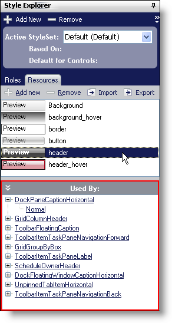

////

|metadata|
{
    "name": "win-new-used-by-list-whats-new-20063",
    "controlName": [],
    "tags": [],
    "guid": "{D0B03249-26F8-4E26-8672-BF7B6D953144}",  
    "buildFlags": [],
    "createdOn": "0001-01-01T00:00:00Z"
}
|metadata|
////

= New "Used By" List

== We Added a "Used By" List to the Resources Tab in the Style Explorer

We already have a "Used By" list in our Role Editor to state which roles are used by which components. Now we've added a "Used By" list to state which Resources are used by which Roles. A Resource can be used by any state of any role, therefore, the "Used By" list will show a list of UI Roles that the Resource applies to and child nodes of specifically which state in the UI Role it applies to.

== Related Topics

link:styling-guide-resources.html[Resources]