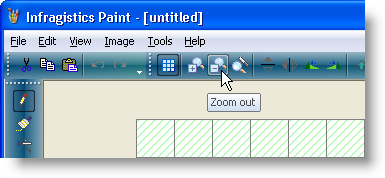
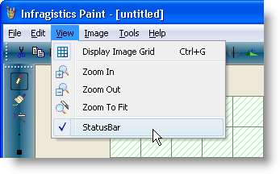

////

|metadata|
{
    "name": "win-new-windows-vista-style-for-wintoolbarsmanager-whats-new-20073",
    "controlName": [],
    "tags": [],
    "guid": "{F016EB21-9436-42C3-8112-E4EDF0B8E696}",  
    "buildFlags": [],
    "createdOn": "0001-01-01T00:00:00Z"
}
|metadata|
////

= New Windows Vista Style for WinToolbarsManager

Microsoft's® Windows® Vista™ user interface (UI) is a significant change from past UIs. The UI brings a modernized and friendly feel to the Windows experience. This release, Infragistics is proud to offer you that same look and feel for WinToolbarsManager™ in our new Windows Vista Look and Feel. At this time, the look and feel only affects WinToolbarsManager and those controls/components that we use to create WinToolbarsManager's components.

=== Toolbars

Toolbars use the WindowsVistaToolbarButton ButtonStyle for its buttons. You can also see unique horizontal and vertical gradients on the toolbars, both including the glass effect.

=== Menus

Toolbar menus also support the Vista style. The most notable feature is an animated fade in which makes for a unique hover effect.

== Related Topics

link:styling-guide-windows-vista-look-and-feel.html[Windows Vista Look and Feel]

link:wintoolbarsmanager-change-the-style-of-wintoolbarsmanager.html[Change the Style of WinToolbarsManager]