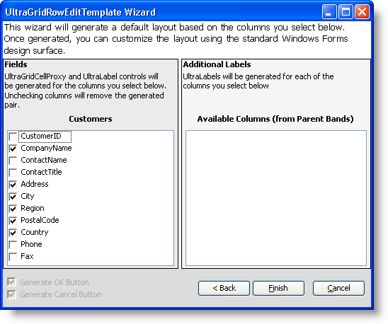

////

|metadata|
{
    "name": "win-new-wingridrowedittemplate-control",
    "controlName": [],
    "tags": [],
    "guid": "{402E78EA-7CB2-427A-B1F4-8D7B3CEF49A8}",  
    "buildFlags": [],
    "createdOn": "0001-01-01T00:00:00Z"
}
|metadata|
////

= New WinGridRowEditTemplate Control

When working with data entry, your end users may not do exactly what you expect them to do. Therefore, it's important for you to guide them through the data entry process as much as possible; WinGridRowEditTemplate™ makes this process much simpler.

With the new WinGridRowEditTemplate control, you can essentially display an entire form overtop WinGrid™, showing your end user only the data they need to modify. WinGridRowEditTemplate displays the data from a single row, allowing your end user to focus on the data they are currently editing.

Creating a row's edit template is easy with the UltraGridRowEditTemplate wizard. Once you drop WinGridRowEditTemplate on the form, and connect it to a band, the wizard displays, allowing you to choose which columns you'd like to show on the template. Once finished, the template is automatically populated, so all you have to do is arrange the controls.

== Related Topics
link:wingridrowedittemplate.html[WinGridRowEditTemplate]

link:wingridrowedittemplate-understanding-wingridrowedittemplate.html[Understanding WinGridRowEditTemplate]

link:wingridrowedittemplate-using-wingridrowedittemplate.html[Using WinGridRowEditTemplate]

link:wingridrowedittemplate-api-overview.html[API Overview]