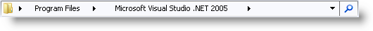
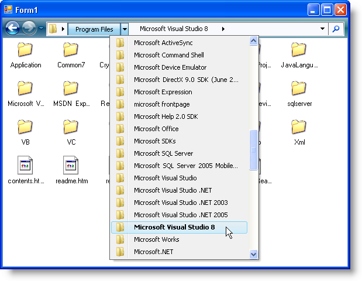

////

|metadata|
{
    "name": "win-new-winnavigationbar-control-whats-new-20073",
    "controlName": [],
    "tags": [],
    "guid": "{E24F4211-F6B3-4619-9A8E-54F6E9C737E1}",  
    "buildFlags": [],
    "createdOn": "0001-01-01T00:00:00Z"
}
|metadata|
////

= New WinNavigationBar Control

Have you ever browsed an online help system with a tree control, such as WinTree™, and wished there was more room in the content pane to view the full help topic? Have you ever browsed a file system with a ListView control, such as WinListView™, delving down into 10 or 20 sub-folders, only to realize you’re in the wrong place and have to click the Back button just as many times? Have you ever used a grid control, such as WinGrid™, to show a table of self-related data, wishing there was a simpler way with less overhead? WinNavigationBar™ rids you of these problems by having a footprint the size of a simple text box. WinNavigationBar shows you only what you need to see: the path you've taken and the choices ahead.

WinNavigationBar is arguably the smallest navigation control in the Infragistics Windows Forms line-up. With it, you can navigate through any hierarchical structure using its flexible object model. WinNavigationBar is essentially a combo box with several drop-down buttons inside. The drop-down box of the combo box contains a list of previously visited locations, while the drop-down buttons inside the control act as previous locations in a path. It is the drop-down paradigm that allows WinNavigationBar to take up such little screen real estate.

== The Breadcrumb

The infamous breadcrumb, originating from the popular Brothers Grim fairy tale, Hansel and Gretel, has been a critical navigation tool in Web sites worldwide. Leaving a trail of breadcrumbs behind, Hansel and Gretel would be able to find their way back through the forest; the same principle applies to navigating through a user interface. As you navigate through a Web site, or a file system, or any hierarchical structure, the breadcrumb displays the path you've taken to get where you are. This allows you to easily navigate back to a point that you've previously passed. The principle of breadcrumbs is exactly what WinNavigationBar is capable of doing, but showing the path taken is only half of its capabilities.

== A Breadcrumb Control that Knows the Future

Whereas a regular breadcrumb control keeps track of where you've been, WinNavigationBar helps you get where you’re going. If you click the drop-down arrow for the last item in the breadcrumb, you’ll get a list of possible locations to which you can navigate. So WinNavigationBar doesn't just keep track of your history, it allows you to create the history based on all available navigation paths. Other breadcrumb controls require another navigation control; WinNavigationBar is unique in that it is the navigation control.

== Related Topics

link:winnavigationbar-about-winnavigationbar.html[About WinNavigationBar]

link:win-winnavigationbar-using-winnavigationbar.html[Using WinNavigationBar]