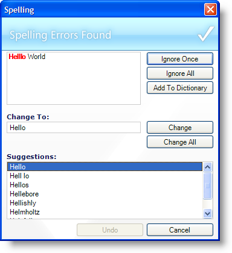

////

|metadata|
{
    "name": "win-new-winspellchecker-control-whats-new-2006-2",
    "controlName": [],
    "tags": [],
    "guid": "{47AD4A53-3E7F-4C9E-80CA-5997B586D64C}",  
    "buildFlags": [],
    "createdOn": "0001-01-01T00:00:00Z"
}
|metadata|
////

= New WinSpellChecker Control

The WinSpellChecker™ component is a new component in Infragistics Windows Forms 2006 Volume 2. With WinSpellChecker, you can check the spelling of several controls including TextBoxes, RichTextBoxes, and any object that implements the IProvideTextBox or ISupportSpellChecking interfaces. The WinSpellChecker component can check spelling as the end user types and automatically correct commonly misspelled words. Misspelled words are underlined with the familiar red squiggly line (or whichever color you wish to change it to).

WinSpellChecker is shipped with dictionary packs for seven different languages including English, Dutch, French, German, Italian, Portuguese, and Spanish. You can also add words to a user dictionary.

With WinSpellChecker, you can create a right-click context menu and display a list of suggested corrections, launch the spell checking dialog box when the end user clicks a toolbar button, and even show the status of the spell checker in a status bar at the bottom of your application. WinSpellChecker can duplicate the Microsoft® Word spell checking functionality that has become a standard in the word-processing community.

== Related Topics

link:winspellchecker-about-winspellchecker.html[About WinSpellChecker]

link:win-winspellchecker-using-winspellchecker.html[Using WinSpellChecker]

link:winspellchecker-adding-winspellchecker-to-a-form.html[Adding WinSpellChecker to a Form]

link:winspellchecker-using-the-spell-checker-dialog.html[Using the Spell Checker Dialog]