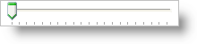
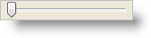

////

|metadata|
{
    "name": "win-new-wintrackbar-control",
    "controlName": [],
    "tags": [],
    "guid": "{6196935A-938C-40AC-BC35-4A8FDC7F1237}",  
    "buildFlags": [],
    "createdOn": "2008-08-01T12:34:26Z"
}
|metadata|
////

= New WinTrackBar Control

Have you been using the in-box TrackBar control and realizing the lack of precision that you wouldn't expect to find in an Infragistics TrackBar control? This is true of several in-box controls, but this release, the wait is over for the WinTrackBar™ control.

The WinTrackBar control is a simple editor that helps your end user choose values from a range of values; but not just one range of values, as many ranges as your application requires. Each range of values that WinTrackBar displays is customized by you, and can have as few or as many tick marks in the range as necessary.

WinTrackBar's look and feel is completely customizable. You can orient WinTrackBar horizontally (the default orientation), or you can have it stand-on-end in a vertical orientation. You can also customize where the tick marks are situated on the TrackBar; have them display on the top or bottom if WinTrackBar is oriented horizontally and left or right if WinTrackBar is oriented vertically.

WinTrackBar also comes with a full array of look and feels. If you're using the link:styling-guide-office-2007-look-and-feel.html[Office 2007] theme including the WinToolbarsManager link:wintoolbarsmanager-working-with-the-ribbon.html[Ribbon] and WinExplorerBar collapsible Outlook pane, you can complete the theme with an Office 2007 TrackBar, similar to Microsoft® Word™.

image::images/Win_New_WinTrackBar_Control_02.png[new ultratrackbar control]

In 2007 Volume 3, we presented you with the Microsoft® Windows® Vista™ theme for WinToolbarsManager. This release, along with link:win-wintree-windows-vista-style.html[WinTree Vista enhancements], WinTrackBar includes a Vista theme to help you implement the Vista TrackBar, seen in the Views drop-down box of the Vista Windows Explorer.

== Related Topics

link:wintrackbar-about-wintrackbar.html[About WinTrackBar]

link:wintrackbar-change-the-orientation-of-wintrackbar.html[Change the Orientation of WinTrackBar]

link:wintrackbar-change-wintrackbars-style.html[Change WinTrackBar's Style]

link:wintrackbar-changing-the-look-location-and-frequency-of-tickmarks.html[Changing the Look, Location, and Frequency of Tickmarks]

link:wintrackbar-synchronizing-two-wintrackbar-controls.html[Synchronizing Two WinTrackBar Controls]