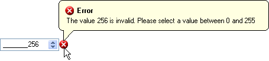

////

|metadata|
{
    "name": "win-new-winvalidator-control",
    "controlName": [],
    "tags": [],
    "guid": "{4A472A5C-B43D-4B2A-B997-C59873AB075F}",  
    "buildFlags": [],
    "createdOn": "0001-01-01T00:00:00Z"
}
|metadata|
////

= New WinValidator Control

Validating windows forms controls has always taken at least a little bit of code. It's not quite as easy as validating an ASP.NET control with their built in validators. Any validating that you perform would be done in the OnValidating event of a control, this makes for a lot of code if you're validating several controls at once. What you need is a single component to perform all your validating tasks for you. You need WinValidator™.

WinValidator can validate any windows forms control through a control's Validating event; or, if you're using an Infragistics embeddable editor, you can change the  pick:[win-forms="link:{ApiPlatform}win.misc{ApiVersion}~infragistics.win.misc.ultravalidator~validationtrigger.html[ValidationTrigger]"]  to validate during the OnPropertyValueChanged event. You can use WinValidator on different controls through the extender properties it exposes. Through these properties, you can easily add new conditions to validate.

WinValidator offers three types of built-in conditions:

*  pick:[win-forms="link:{ApiPlatform}win{ApiVersion}~infragistics.win.operatorcondition.html[Operator]"]  – The operator condition allows you to perform several standard comparing operations between the value in the control, and the  pick:[win-forms="link:{ApiPlatform}win{ApiVersion}~infragistics.win.operatorcondition~comparevalue.html[CompareValue]"]  of the OperatorCondition. See  pick:[win-forms="link:{ApiPlatform}win{ApiVersion}~infragistics.win.conditionoperator.html[ConditionOperator]"]  for a full list of conditions.
*  pick:[win-forms="link:{ApiPlatform}win{ApiVersion}~infragistics.win.rangecondition.html[Range]"]  – The range condition allows you to determine if a specific value is between the  pick:[win-forms="link:{ApiPlatform}win{ApiVersion}~infragistics.win.rangecondition~minimumvalue.html[MinimumValue]"]  and  pick:[win-forms="link:{ApiPlatform}win{ApiVersion}~infragistics.win.rangecondition~maximumvalue.html[MaximumValue]"] .
*  pick:[win-forms="link:{ApiPlatform}win{ApiVersion}~infragistics.win.containedinlistcondition.html[List]"]  – The ContainedInListCondition object allows you to determine if a specific value is contained in a supplied  pick:[win-forms="link:{ApiPlatform}win{ApiVersion}~infragistics.win.valuelist.html[ValueList]"] . You can either supply a new ValueList at design time, or you can use a ValueList created at run time. The  pick:[win-forms="link:{ApiPlatform}win{ApiVersion}~infragistics.win.listitemmatchmode.html[ListItemMatchMode]"]  allows you to match either the ValueListItem's  pick:[win-forms="link:{ApiPlatform}win{ApiVersion}~infragistics.win.valuelistitem~displaytext.html[DisplayText]"]  or  pick:[win-forms="link:{ApiPlatform}win{ApiVersion}~infragistics.win.valuelistitem~datavalue.html[DataValue]"] .

By default, WinValidator will display an image next to the control when it fails validation. You can change the Action that WinValidator performs when a control fails validation to a message box, balloon tip, or dialog box. These methods of information delivery are all customizable through the  pick:[win-forms="link:{ApiPlatform}win.misc{ApiVersion}~infragistics.win.misc.notificationsettings.html[NotificationSettings]"]  object. Through this object, you can set the caption, text, and image to something that suits your entire application, or you can override each notification by setting these properties through the extender properties on the individual controls themselves.

== Related Topics

link:winvalidator.html[WinValidator]

link:winvalidator-understanding-winvalidator.html[Understanding WinValidator]

link:winvalidator-using-winvalidator.html[Using WinValidator]

link:winvalidator-api-overview.html[API Overview]