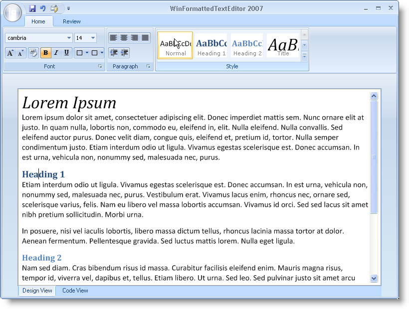

////

|metadata|
{
    "name": "win-office-2007-view-style-whats-new-20063",
    "controlName": [],
    "tags": [],
    "guid": "{F064FA50-A453-4237-AD4F-15C91073C9FF}",  
    "buildFlags": [],
    "createdOn": "0001-01-01T00:00:00Z"
}
|metadata|
////

= Office 2007 View Style

In 2006 Volume 3, we added the Office 2007 View Style to several of our controls to change the look of the control. To use this style, simply change either the ViewStyle, DisplayStyle, ButtonStyle properties (depending on the control) to Office2007 and you're done.

We also support the two Office 2007 color schemes: Windows XP (Blue), Windows XP Silver (Silver), and Windows Vista (Black). Changing between these three color schemes is easy as well, all you need to do is set the static property  pick:[win-forms="link:{ApiPlatform}win{ApiVersion}~infragistics.win.office2007colortable~colorscheme.html[Infragistics.Win.Office2007ColorTable.ColorScheme]"]  to Blue, Silver, or Black. For a full list of the controls and components affected by the new Office 2007 look and feel, see link:styling-guide-office-2007-look-and-feel.html[Office 2007 Look and Feel].

