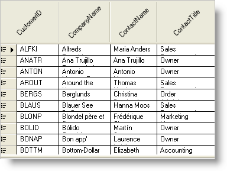

////

|metadata|
{
    "name": "win-rotating-column-headers",
    "controlName": [],
    "tags": [],
    "guid": "{F3284A47-C412-48EE-B5BC-B79ACB80317B}",  
    "buildFlags": [],
    "createdOn": "0001-01-01T00:00:00Z"
}
|metadata|
////

= Rotating Column Headers

We've always been careful to include the features that you need and want inside of WinGrid™; including the Microsoft® Excel® features that allow you to display and print similar to an Excel spreadsheet. This release, we're continuing the Excel offering with rotating column headers.

Rotating column headers help you achieve a more usable and clean user interface, while potentially slimming down the entire width of your grid. Rotating a column header reclaims a significant amount of horizontal screen real estate, while only sacrificing a small portion of vertical real estate. This tactic is most useful when displaying large amounts of numerical data where a columns width would be lengthened by the header, not the column's data.

== Related Topics

link:wingrid-rotating-text-in-wingrids-column-headers.html[Rotating Text in WinGrid's Column Headers]