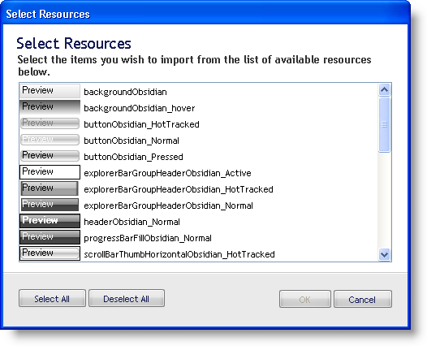
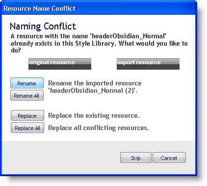

////

|metadata|
{
    "name": "win-selective-importing-whats-new-20063",
    "controlName": [],
    "tags": [],
    "guid": "{721A1141-D6F7-4014-82B1-DC3F27058867}",  
    "buildFlags": [],
    "createdOn": "0001-01-01T00:00:00Z"
}
|metadata|
////

= Selective Importing

== You Can Now Select which Resources You Want to Import

When you click Import Resources in the main File menu or in the Resources tab of the Style Explorer and open a Style Library, a Choose Resource(s) dialog box opens. This dialog box shows all resources that can be imported from the selected Style Library. By selecting a few resources, either using the Shift button or Ctrl button, you can specify which resources you'd like to import. If one of the resources already exists in your Style Library, it will ask you how to resolve the name conflict. This new dialog box is an excellent way to help manage your growing resource library.

== Related Topics

link:styling-guide-resources.html[Resources]

link:styling-guide-importing-and-exporting-resources.html[Importing and Exporting Resources]