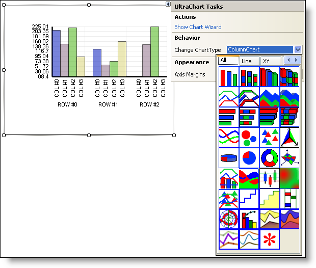

////

|metadata|
{
    "name": "win-smart-tag-support-whats-new-2005-3",
    "controlName": [],
    "tags": [],
    "guid": "{F05D5060-E4CE-4542-8403-075D55678DE7}",  
    "buildFlags": ["win-forms"],
    "createdOn": "0001-01-01T00:00:00Z"
}
|metadata|
////

= Smart Tag Support

The Smart Tags feature – new in Visual Studio 2005 (.NET Framework 2.0) – allows you to quickly access the most commonly used properties and options, as well as perform customary tasks without having to leave the control’s design surface.

To allow for increased productivity, Infragistics has leveraged this feature by providing a Smart Tag that is specific to each Windows Forms control/component. In a single click, you can access the most common properties and options of a specific control/component without moving your focus from the form.

As shown in the WinChart™ Smart Tag example below, you can easily change the chart type of the WinChart control, using the pop-up panel of the Smart Tag.

