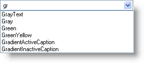
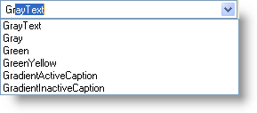

////

|metadata|
{
    "name": "win-suggest-mode-for-wincomboeditor",
    "controlName": [],
    "tags": [],
    "guid": "{CB202042-5A51-45A8-9468-C00661514FBB}",  
    "buildFlags": [],
    "createdOn": "0001-01-01T00:00:00Z"
}
|metadata|
////

= Suggest Mode for WinComboEditor

Google™ Labs develops new and exciting tools for web applications. One of these innovations is Google Suggest, a combo box using a drop-down list to suggest search terms in real time as you type. Realizing the value this feature could add to a windows forms application, we implemented a suggest feature of our own for WinComboEditor™.

Using the new  pick:[win-forms="link:{ApiPlatform}win.ultrawineditors{ApiVersion}~infragistics.win.ultrawineditors.ultracomboeditor~autocompletemode.html[AutoCompleteMode]"]  property, you can select between three types of suggest modes.

* *Append* – Setting AutoCompleteMode to Append will add the remainder of the most likely candidate string to the end of the typed string. The remainder is highlighted to allow your end user to type over with the next letter.

* *Suggest* – As the end user types, WinComboEditor's drop-down box displays populated with the most likely candidate items.

* *SuggestAppend* – Setting AutoCompleteMode to SuggestAppend simply combines the Suggest and Append features.

Not only did we implement similar functionality on WinComboEditor, but it's associated embeddable editor,  pick:[win-forms="link:{ApiPlatform}win{ApiVersion}~infragistics.win.editorwithcombo.html[EditorWithCombo]"] . This allows you to use the suggest feature in WinCombo™, as well as WinGrid™ columns. This enables you to create more sophisticated drop-down lists. 

== Related Topics

link:wincomboeditor-suggest-possible-values-with-wincomboeditor.html[Suggest Possible Values with WinComboEditor]