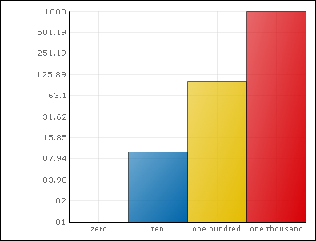

////

|metadata|
{
    "name": "win-support-for-zero-data-points-in-charts-having-logarithmic-axes-whats-new-20073",
    "controlName": [],
    "tags": [],
    "guid": "{F462C3B5-0931-4530-9D1A-0CD6B3429642}",  
    "buildFlags": [],
    "createdOn": "0001-01-01T00:00:00Z"
}
|metadata|
////

= Support for Zero Data Points in Charts Having Logarithmic Axes

Previous versions of Infragistics Professional would throw an exception if zero data values were passed as data to your chart with a Logarithmic axis, since mathematically, the logarithm of zero is undefined. With the Infragistics Windows Forms 2007 Volume 3 release, you can set another value for the logarithm of 0 to allow zero data points to be supplied as part of a data set you wish to view on your chart with a logarithmic axis.

You can set the new LogZero property on the AxisAppearance object to a specific value that will represent the value when your chart tries to plot Log(0). The ToolTip will still display "0".

The default value for the LogZero property is double.NaN. If you leave this property at the default value, an exception will be thrown.

The following screen shot shows a column chart with a logarithmic y-axis and a zero value.

== Related Topic

link:chart-linear-and-logarithmic-axes.html[Linear and Logarithmic Axes]