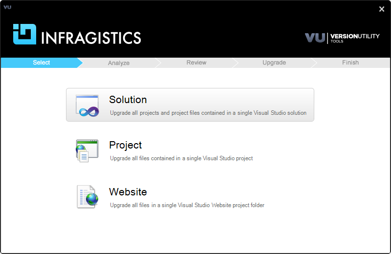
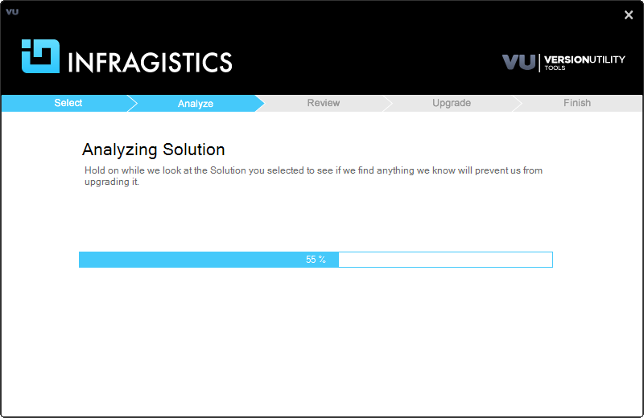
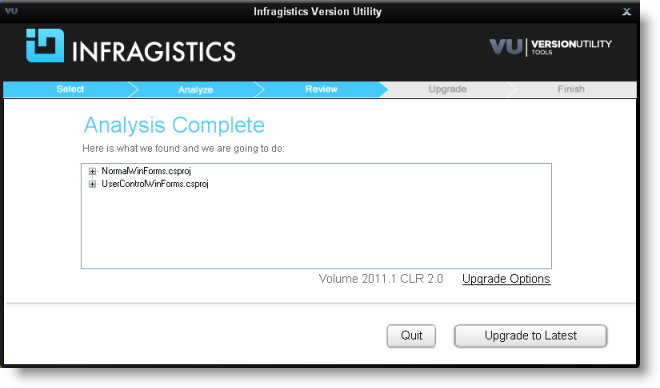
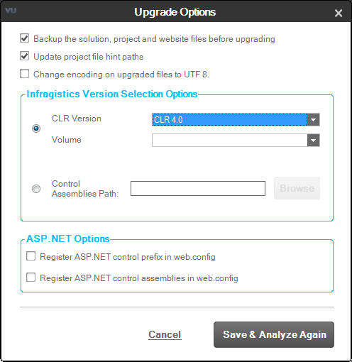
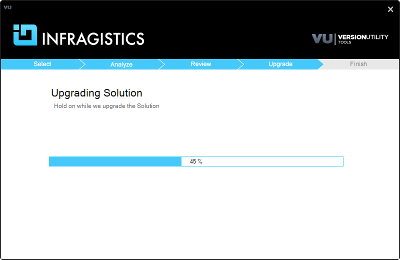
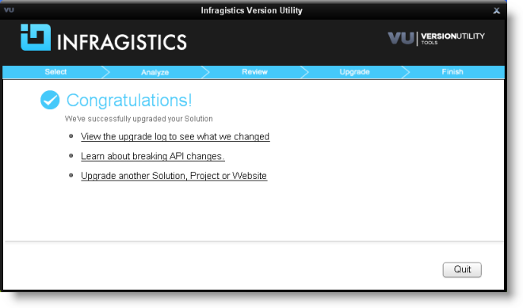
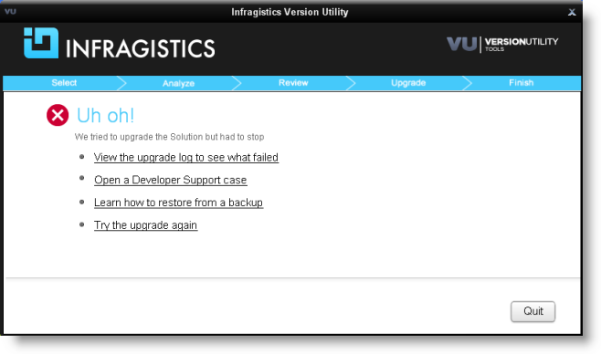

////

|metadata|
{
    "name": "win-upgrading-a-project-to-infragistics-windows-forms-11.1-(and-above)-using-version-utility",
    "controlName": [],
    "tags": ["How Do I"],
    "guid": "6c9a4ab3-1334-4274-b1be-9fb71b0211c7",  
    "buildFlags": [],
    "createdOn": "2011-06-03T15:00:00.2144916Z"
}
|metadata|
////

= Using Version Utility

Infragistics provides a special tool called “Version Utility” which allows you to easily upgrade existing solutions to a volume of Infragistics.

.Note
[NOTE]
====
Version Utility 11.1 is designed to upgrade projects to Infragistics 11.1 or higher. If you need to upgrade to one of the previous versions of the Infragistics (ex. 10.3) you should use the Version Utility that was shipped with that volume.
====

With the Version Utility you can upgrade:

* Solution
+
Upgrade all projects and project files contained in a single Visual Studio™ solution.

* Project
+
Upgrade all files contained in a single Visual Studio project.

* Website
+
Upgrade all files in a single Visual Studio Website project folder.

There are three editions of the utility depending on the interface used – a command line interface, an Add-in interface and a Stand-Alone application. All these are using the same core so you can choose the one that you prefer. The changes made during the upgrade are written to a log file regardless of the interface used.

This topic explains how to use the Stand-Alone interface.

== Before You Start

Before upgrading your content, be sure to consider the following:

* If you are moving your solution from one version of Visual Studio to another, the Visual Studio upgrade should be done before using the utility. The supported versions for the Visual Studio are 2008 and above and the utility can upgrade the Infragistics versions 2005 and later.
* If you are upgrading the .Net version of your projects, you should perform it before using the Version Utility
* Before executing the version utility you should ensure that the files in the solution are not marked read-only. If the files are under source control you should check them out before launching the utility.
* Ensure that the Infragistics product version that you wish to upgrade to is installed on the computer that you will use to perform the upgrade. If it is not installed, then it wouldn’t be possible to perform the upgrade.

== Overview

Following is an overview of the upgrading procedure:

. <<Starting,Starting the Utility>>

. <<Selecting,Selecting the content type>>

. <<Reviewing,Reviewing the files to upgrade>>

. _(Optional)_  <<Customizing,Customizing the upgrade>>

. <<Performing,Performing the upgrade>>

. <<Finalizing,Finalizing the process>>

== Steps

[[Starting]]
. *Starting the Utility*
+
This opens the first screen of the Utility, Select.
[[Selecting]]
. *Selecting the content type*
+
Select the type of content you wish to upgrade, navigate to it and load it:
+

+
Figure 1: The Select step of the Version Utility
+
Once the content is loaded, the Version Utility will start analyzing it, during which it will be displaying its next screen, Analyze:
+

+
Figure 2: The Analyze step of the Version Utility
+
When the analysis is complete the Utility creates a task list which outlines the files that need to be processed. This takes you to the next step.
[[Reviewing]]
. *Reviewing the files to upgrade*
+
Review the tasks by expanding each list item.
+

+
Figure 3: The Review step of the Version Utility
[[Customizing]]
. *_(Optional)_  Customizing the upgrade*
+
To customize the upgrade, click the Upgrade Options link. This opens the Upgrade Options dialog:
+

+
Figure 4: The Upgrade Options dialog
+
.Note
[NOTE]
====

* Use the Control Assemblies Path option to make sure you have all the necessary assemblies in one folder. The Utility allows you to select a single folder that contains the assemblies - there is no recursive search in its subfolders.
* If you want to use custom Upgrade Options a new analysis will be performed based on the settings you have chosen.

====
[[Performing]]
. *Performing the upgrade*
+
When the analysis is complete, click the upgrade button. The upgrade process begins:
+

+
Figure 5: The Upgrade step of the Version Utility
+
The Utility will modify only the necessary files to upgrade a solution. Only the following files within a solution are modified:
+
* Project file
* app.config
* .licx
* .cs .vb
* .resx

+
Once the process is complete, you are taken to the final step of the Utility.
[[Finalizing]]
. *Finalizing the process*
+
* *Successful Conversion*
+
Upon successful completion of all identified upgrade tasks, the Version Utility will inform you of the success and will provide a link to the log file for the modifications:
+

+
Figure 6: The Finish step of the Version Utility - upgrade successful
+
If the option to allow backups has been enabled, any changed file has been backed up to the Utility’s Backup folder.
+
.Note
[NOTE]
====
The option Upgrade another Solution, Project or Website gives you a quick way to convert another solution with the same conversion options. However, if you need different settings for the upgrade process you have to quit the application and run it anew.
====
+
At this point, you should take the same actions that you normally take when changes have been made to the source code of your application (like opening the application in Microsoft® Visual Studio, and then reviewing the source code, compiling, and testing).

* *Unsuccessful Conversion*
+
If the Utility encounters a condition which it cannot handle it will stop the upgrade process at the point where the error occurred and will inform you of the situation:
+

+
Figure 7: The Finish step of the Version Utility - upgrade unsuccessful
+
At this time, you can use the log file to identify what caused the error and try to fix the error manually. If you resolve the error reported in the log file, you can try the upgrade process again to give the Utility the chance to process the upgrade tasks that have not been completed yet. As an alternative, you can, of course, upgrade your application manually.