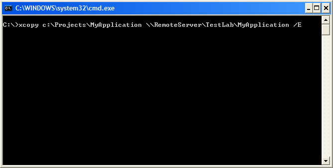

////

|metadata|
{
    "name": "win-using-xcopy-deployment",
    "controlName": [],
    "tags": [],
    "guid": "{D7979A38-7A4E-489E-A617-5E710B20D8E3}",  
    "buildFlags": [],
    "createdOn": "2005-07-06T00:00:00Z"
}
|metadata|
////

= Using XCOPY Deployment

One of the primary goals of the .NET Framework is to simplify deployment by making possible what is known as XCOPY deployment. Prior to the introduction of .NET, deploying application components required copying the files to the correct directory and making the appropriate registry changes. This process generally required elevated security rights and had severe limitations when installing different versions of the same application components. All of these problems lead to the process of deploying components being known as "DLL Hell".

$$.NET$$ attempted to address these problems by removing many of the restrictions the old deployment process had. To install a .NET component all you need to do is copy the components assembly into the applications directory and the application starts using it right away. This is possible because of the self-describing nature of the .NET assemblies. Compilers in the .NET Framework embed identifiers or meta-data into compiled modules while the Common Language Runtime (CLR) uses this information to load the appropriate version of the assemblies. The identifiers contain all the information required to load and run modules, and also to locate all the other modules referenced by the assembly.

This type of deployment, called XCopy deployment has zero-impact on the installation machine because it is there is no configuring of registry entries or configuring the component. XCopy deployment also makes it possible to uninstall a component without impacting the system in any manner. All that is required to complete uninstallation is the removal of specific files from the specific directory.

== Using XCopy to Deploy Applications

To use XCopy deployment to deploy your applications components, you simply need to go to the Command Prompt and copy over the required files to a specific directory on the server using the XCOPY command.

The following screen shot illustrates the use of XCOPY deployment to deploy the Windows application named TestLab\MyApplication to the target server named RemoteServer.

The XCOPY command support a number of arguments.

* / E - Copy directories, subdirectories, and files of the source argument, including empty ones.
* / K - Retain all the existing file and folder attributes. When you use XCOPY to copy files or a directory tree structure, XCOPY strips off file attributes by default. For example, if a file had the read-only attribute set, that attribute would be lost after the file is copied. To retain the original attributes with the copied files, you must use the / K parameter.
* / R - Overwrite files marked as read only.
* / O - Preserve all security-related permission ACLs of the file and folders.
* / H - Copy both hidden and system files.
* / I - Assume that the destination is a directory and create it if it does not already exist.

Please refer to the MSDN help documentation for more information on the different options supported by link:http://www.microsoft.com/resources/documentation/windows/xp/all/proddocs/en-us/xcopy.mspx[XCOPY command].