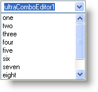
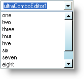

////

|metadata|
{
    "name": "win-valuelist-scrollbars-are-now-stylable-whats-new-2006-2",
    "controlName": [],
    "tags": ["Application Scenarios","Styling"],
    "guid": "{E50DE24A-ACC0-4828-B7E8-57EF26915474}",  
    "buildFlags": [],
    "createdOn": "0001-01-01T00:00:00Z"
}
|metadata|
////

= ValueList Scrollbars are Now Stylable

One aspect of a Infragistics Windows Forms application that you could not style previously was a ValueList's scrollbars. With Infragistics Windows Forms 2006 Volume 2, styling ValueList scrollbars is a simple task as all it involves is assigning an  pick:[win-forms="link:{ApiPlatform}win{ApiVersion}~infragistics.win.appearance.html[Appearance]"]  object. Just create an Appearance object and assign it to a  pick:[win-forms="link:{ApiPlatform}win{ApiVersion}~infragistics.win.ultrawinscrollbar.scrollbarlook.html[ScrollBarLook's]"]  Appearance property. If you don't feel comfortable using Appearance objects, you also have the option of changing the appearance of the ScrollBarLook object at design time.

Any control that uses ValueLists can take advantage of this new functionality including:

* WinComboEditor™ and derived controls
* WinExplorerBar™
* WinGrid™
* WinListView™
* WinSchedule™
* WinTree™

The left and right example screenshots below show WinComboEditor without and with a styled ValueList scrollbar, respectively.

== Related Topics:

link:winexplorerbar-style-the-scrollbars-of-winexplorerbar.html[Style the Scrollbars of WinExplorerBar]

link:winlistview-style-the-scrollbars-of-winlistview.html[Style the Scrollbars of WinListView]

link:wintree-style-the-scrollbars-of-wintree.html[Style the Scrollbars of WinTree]