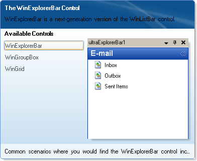

////

|metadata|
{
    "name": "win-visual-studio-2008-window-style-for-windockmanager",
    "controlName": [],
    "tags": [],
    "guid": "{EDA8381F-F248-4A5B-BC4E-16D8A0AEF63A}",  
    "buildFlags": [],
    "createdOn": "0001-01-01T00:00:00Z"
}
|metadata|
////

= Visual Studio 2008 Window Style for WinDockManager

With the release of Microsoft® Visual Studio® 2008 came a new docking pane style, both for Windows® XP and Windows Vista. We've emulated this new style in WinDockManager, enabling you to use Visual Studio 2008-style docking in your applications. You can access this new style by setting the  pick:[win-forms="link:{ApiPlatform}win.ultrawindock{ApiVersion}~infragistics.win.ultrawindock.ultradockmanager~captionstyle.html[CaptionStyle]"]  and  pick:[win-forms="link:{ApiPlatform}win.ultrawindock{ApiVersion}~infragistics.win.ultrawindock.ultradockmanager~windowstyle.html[WindowStyle]"]  properties to VisualStudio2008.

In addition, the drag indicators for Windows Vista look quite different than those in Windows XP, so we've added a new  pick:[win-forms="link:{ApiPlatform}win.ultrawindock{ApiVersion}~infragistics.win.ultrawindock.ultradockmanager~dragindicatorstyle.html[DragIndicatorStyle]"]  enumeration to give your application the Vista look and feel.

[cols="a,a"]
|====
|image::images/Win_Visual_Studio_2008_Window_Style_for_WinDockManager_01.png[visual studio 2008 window style for ultradockmanager]
|image::images/Win_Visual_Studio_2008_Window_Style_for_WinDockManager_02.png[visual studio 2008 window style for ultradockmanager]

|Visual Studio 2008 XP
|Visual Studio 2008 Vista

|====

You may also have noticed that the Navigator has been given a completely different look in Visual Studio 2008, including a preview of the selected item. Don't worry, we've added all the necessary appearance objects and preview capability to the  pick:[win-forms="link:{ApiPlatform}win.ultrawindock{ApiVersion}~infragistics.win.ultrawindock.ultradockmanager~navigatorsettings.html[NavigatorSettings]"]  object.

== Related Topics

link:windockmanager-change-windockmanagers-style.html[Change WinDockManager's Style]

link:windockmanager-show-or-hide-the-preview-in-the-navigator.html[Show or Hide the Preview in the Navigator]