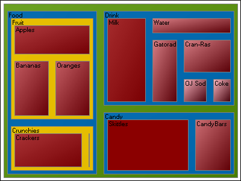

////

|metadata|
{
    "name": "win-whats-new-2008-2-new-treemap-chart-added",
    "controlName": [],
    "tags": [],
    "guid": "{68C3883B-174E-4C66-B0AA-2D3C0E31827C}",  
    "buildFlags": [],
    "createdOn": "0001-01-01T00:00:00Z"
}
|metadata|
////

= New Treemap Chart Added

We added a new Treemap chart to the WinChart™ component.

Treemap charts are used to display large hierarchical data sets in a rectangle space. Treemap charts are typically used to visualize the contents of a hard drive with thousands of files in many levels of directories.

== Related Topic

link:chart-treemap-chart-2d.html[Treemap Chart]