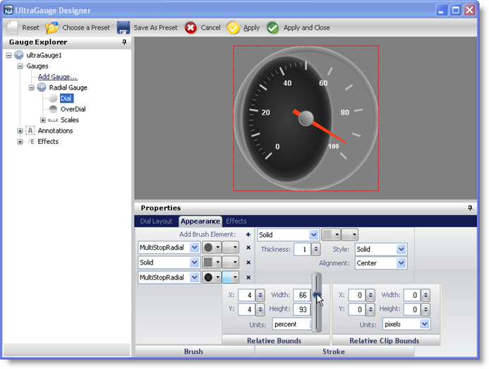

////

|metadata|
{
    "name": "win-wingauges-new-relativebounds-designer-editor",
    "controlName": [],
    "tags": [],
    "guid": "{627386DE-9F0D-428A-9C9F-130231A1AB16}",  
    "buildFlags": [],
    "createdOn": "2007-07-09T11:51:28Z"
}
|metadata|
////

= WinGauge's New RelativeBounds Designer Editor

In the 2007 Volume 3 release, a Relative Bounds editor for BrushElements will be available for the designer in WinGauge™. The Relative Bounds editor consists of two separate editors, a Relative Bounds editor and a Relative Clip Bounds editor.

The BrushElement framework allows the layering of multiple BrushElements. With the introduction of these new editors you can shift and scale each layer's bounds using the designer. You can now create complex brushes using the designer without writing any code or using the Collection editors.

The following screen shot shows a Radial gauge with the BrushElements being edited using the Relative Bounds editor.

== Related Topics

link:wingauge-relative-bounds.html[Relative Bounds]

link:wingauge-relative-clip-bounds.html[Relative Clip Bounds]