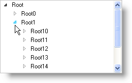
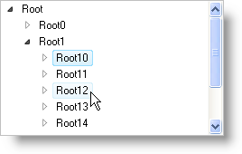
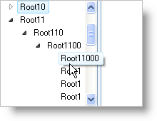
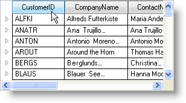

////

|metadata|
{
    "name": "win-wintree-windows-vista-style",
    "controlName": [],
    "tags": [],
    "guid": "{04E10652-05A4-4270-98CF-0220188E36F6}",  
    "buildFlags": [],
    "createdOn": "2008-08-01T16:15:52Z"
}
|metadata|
////

= WinTree Windows Vista Style

In 2007 Volume 3, we gave you the Microsoft® Windows® Vista™ style for WinToolbarsManager; now, you're getting the Windows Vista style for WinTree™. Emulating the popular look and feel of the Windows Explorer in Windows Vista, you get all the great looks by simply flipping a switch: the new  pick:[win-forms="link:{ApiPlatform}win.ultrawintree{ApiVersion}~infragistics.win.ultrawintree.ultratree~displaystyle.html[DisplayStyle]"]  property. Set the DisplayStyle property to WindowsVista, and you're done styling the entire WinTree control!

A few of the exciting Windows Vista styles that you'll see in WinTree include:

* *Scrolling* – WinTree automatically scrolls the tree horizontally to bring the current node into view.
* *Expansion Indicators* – These little images, sporting the Vista color scheme, let you know whether a node is expanded, or can be expanded.

* *Colors* – Taken from the  pick:[win-forms="link:{ApiPlatform}win{ApiVersion}~infragistics.win.windowsvistacolortable.html[WindowsVistaColorTable]"]  object, you'll see that selected and hot tracked nodes display a cool blue gradient. You'll also see these colors in the expansion indicators mentioned above.

* *ToolTips* – When the entire node's name can't fit in the allotted space, a ToolTip displays the entire node's name. This ToolTip looks just like the node would if it didn't run out of space.

* *Headers* – When using multiple columns, you'll see a new header style that resembles the Vista Windows Explorer.

== Related Topics

link:styling-guide-windows-vista-look-and-feel.html[Windows Vista Look and Feel]