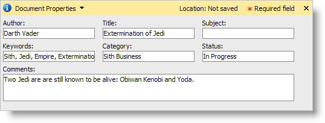
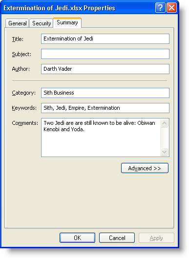

////

|metadata|
{
    "name": "win-you-can-now-add-document-properties-to-excel-workbooks-whats-new-20072",
    "controlName": [],
    "tags": [],
    "guid": "{97E433ED-514D-4568-843C-1A2C97C6A3C0}",  
    "buildFlags": [],
    "createdOn": "0001-01-01T00:00:00Z"
}
|metadata|
////

= You Can Now Add Document Properties to Excel Workbooks

With the 2007 Volume 2 release, you can now add identifying information to your Microsoft® Excel® workbook. The  pick:[win-forms="link:{ApiPlatform}documents.excel{ApiVersion}~infragistics.documents.excel.documentproperties.html[DocumentProperties]"]  object contains several useful properties such as  pick:[win-forms="link:{ApiPlatform}documents.excel{ApiVersion}~infragistics.documents.excel.documentproperties~author.html[Author]"] ,  pick:[win-forms="link:{ApiPlatform}documents.excel{ApiVersion}~infragistics.documents.excel.documentproperties~title.html[Title]"] ,  pick:[win-forms="link:{ApiPlatform}documents.excel{ApiVersion}~infragistics.documents.excel.documentproperties~subject.html[Subject]"] ,  pick:[win-forms="link:{ApiPlatform}documents.excel{ApiVersion}~infragistics.documents.excel.documentproperties~comments.html[Comments]"] , and several other properties. Once exported, you can find these properties by right-clicking the Excel file, selecting Properties, and clicking the Summary tab in the Properties dialog box. If you are using Excel 2007, after opening the Excel file, click the Office Button, point to Prepare, and then click Properties.

== Related Topic

link:excelengine-add-document-properties-to-a-workbook.html[Add Document Properties to a Workbook]