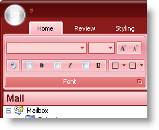

////

|metadata|
{
    "name": "win-you-can-now-blend-a-custom-color-with-the-office-2007-color-scheme-whats-new-20071",
    "controlName": [],
    "tags": [],
    "guid": "{2A8B365A-5422-4840-9DB9-E1BA817CD82E}",  
    "buildFlags": [],
    "createdOn": "0001-01-01T00:00:00Z"
}
|metadata|
////

= You Can Now Blend a Custom Color with the Office 2007 Color Scheme

In the 2006 Volume 3 release, we offered the Office 2007 look and feel. With this look and feel came three distinct color schemes: blue, black, and silver. Although visually appealing, being able to use only three colors out of more than 65,000 is a little restricting. Therefore, in 2007 Volume 1, we're giving you the ability to blend any color with the three existing color schemes. Using the new  pick:[win-forms="link:{ApiPlatform}win{ApiVersion}~infragistics.win.office2007colortable~customblendcolor.html[CustomBlendColor]"]  property off the  pick:[win-forms="link:{ApiPlatform}win{ApiVersion}~infragistics.win.office2007colortable.html[Office2007ColorTable]"]  object, you can blend any system color with the Blue, Black, or Silver color schemes.

== Related Topic

link:win-blend-a-custom-color-with-office-2007-style-color-schemes.html[Blend a Custom Color with Office 2007-Style Color Schemes]