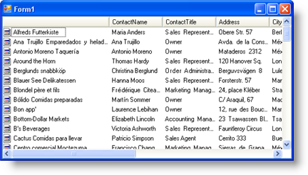
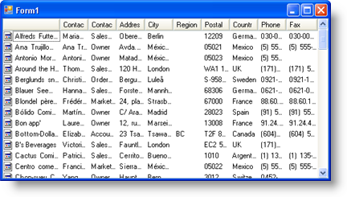

////

|metadata|
{
    "name": "win-you-can-now-fit-all-winlistview-columns-in-the-available-space",
    "controlName": [],
    "tags": [],
    "guid": "{5B37A71D-4C20-472F-B326-F29CACA7876B}",  
    "buildFlags": [],
    "createdOn": "2008-08-01T16:28:30Z"
}
|metadata|
////

= You Can Now Fit All WinListView Columns in the Available Space

WinListView™ can display several columns of data in its Details view, allowing you to add extra detail about each item in the main column. This release, we've added functionality to allow your end users to automatically resize each column so the columns fit in the horizontal space available. The end user automatically resizes the columns by double-clicking the right side of the column header. Alternatively, you can control the resizing through the new APIs that we've added.

The new  pick:[win-forms="link:{ApiPlatform}win.ultrawinlistview{ApiVersion}~infragistics.win.ultrawinlistview.ultralistviewdetailssettings~autofitcolumns.html[AutoFitColumns]"]  property turns this new functionality on, while the  pick:[win-forms="link:{ApiPlatform}win.ultrawinlistview{ApiVersion}~infragistics.win.ultrawinlistview.ultralistviewdetailssettings~columnautosizemode.html[ColumnAutoSizeMode]"]  property determines exactly how you want the columns to resize when your end user double-clicks a column header. However, you don't have to wait for your end user to interact in order to auto-size the columns. With the  pick:[win-forms="link:{ApiPlatform}win.ultrawinlistview{ApiVersion}~infragistics.win.ultrawinlistview.ultralistviewcolumnbase~performautoresize.html[PerformAutoSize]"]  method, you can auto-size the columns whenever you need to; you can even specify the type of resizing through an optional parameter.

The following screen shots demonstrate how WinListView resizes its columns. The first screen shot demonstrates the default behavior. The second screen shot demonstrates fitting all columns in view.

== Related Topics

link:winlistview-resize-a-column-in-details-view.html[Resize a Column in Details View]

link:winlistview-automatically-fit-all-columns-in-details-view.html[Automatically Fit All Columns in Details View]