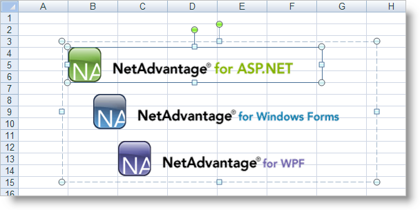

////

|metadata|
{
    "name": "win-you-can-now-insert-images-into-excel-worksheet-cells-whats-new-20072",
    "controlName": [],
    "tags": [],
    "guid": "{7D1C1DAF-00E0-49C9-8CE9-15F0EB4C3B0E}",  
    "buildFlags": [],
    "createdOn": "0001-01-01T00:00:00Z"
}
|metadata|
////

= You Can Now Insert Images into Excel Worksheet Cells

We understand that images and graphics can make the difference between a drab handout and a brilliant presentation. That's why it was important to add images to our Microsoft® Excel® object model. By creating a  pick:[win-forms="link:{ApiPlatform}documents.excel{ApiVersion}~infragistics.documents.excel.worksheetimage.html[WorksheetImage]"]  object and setting it to an Image (through an ImageList, embedded resource, or other means), you'll be able to access numerous properties helping you position the image in any cell(s). Add that WorksheetImage object to the  pick:[win-forms="link:{ApiPlatform}documents.excel{ApiVersion}~infragistics.documents.excel.worksheet.html[Worksheet's]"]   pick:[win-forms="link:{ApiPlatform}documents.excel{ApiVersion}~infragistics.documents.excel.worksheet~shapes.html[Shapes]"]  collection and you're done. You can now add company logos, employee photographs, product shots, or any other array of useful images to your Excel spreadsheets. You're limited only by your own imagination.

== Related Topic

link:excelengine-add-an-image-to-a-worksheet.html[Add an Image to a Worksheet]