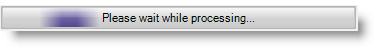
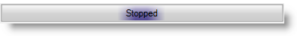

////

|metadata|
{
    "name": "winactivityindicator-displaying-text-on-activity-indicator",
    "controlName": ["WinActivityIndicator"],
    "tags": [],
    "guid": "d282fd66-cdfd-40e4-934b-3fe74af1ee34",  
    "buildFlags": [],
    "createdOn": "2013-01-23T17:12:11.8438589Z"
}
|metadata|
////

= Displaying Text on Activity Indicator

== Topic Overview

=== Purpose

This topic provides an overview of displaying text on the activity indicator with animation enabled or started.

=== Required background

The following topic is a prerequisite to understanding this topic:

[options="header", cols="a,a"]
|====
|Topic|Purpose

| link:winactivityindicator-understanding-winactivityindicator.html[Understanding WinActivityIndicator]
|The topics in this section will give you a better idea of why you would want to use WinActivityIndicator in your applications.

|====

=== In this topic

This topic contains the following sections:

* <<_Ref345936090,Displaying Text on  _WinActivityIndicator_  >>

** <<_Ref341518673,Introduction and preview>>
** <<_Ref341518679,Property settings>>

* <<_Ref341518687,Related Content>>

[[_Ref341518665]]
[[_Ref343696074]]
[[_Ref345936090]]
== Displaying Text on  _WinActivityIndicator_

[[_Ref341518673]]

=== Introduction and preview

Prior to the product release of 13.1, the  _WinActivityIndicator™_   did not display text while the activity indicator was in progress only displaying the animation indicating the ongoing activity. The following screenshot captures the started and stopped animation with the displayed text “ _Please wait while processing…_  ” and “stopped”.

Animation started.

Animation stopped.

.Note:
[NOTE]
====
The control’s `UseOsThemes` property is turned Off by default. If you turn it On, it will overlay the animation text. You may consider using the AppStylist® as a recommended choice for styling your application.
====

[[_Ref341518679]]

=== Property settings

The  _WinActivityIndicator_   control exposes two properties, `Text` and link:infragistics4.win.v{ProductVersion}~infragistics.win.ultraactivityindicator.ultraactivityindicator~animationenabledtext.html[AnimationEnabledText]. The `Text` property displays the text when animation is not in progress while the `AnimationEnabledText` property displays the text when animation is in progress.

The following scenarios cover the text resolution process:

1. When `AnimationEnabled = True`

* The control displays the `AnimationEnabledText` property’s value, if it is not null or empty.

* The control displays the `Text` property’s value if the `AnimationEnabledText` property is null or empty.

2. When `AnimationEnabled = False`

* The control displays the `Text` property’s value.

You can set the properties in code or via the Visual Studio design view.

*In C#:*

[source,csharp]
----
ultraActivityIndicator1.Text = "Stopped";
ultraActivityIndicator1.AnimationEnabledText = "Please wait while processing...";
----

*In Visual Basic:*

[source,vb]
----
ultraActivityIndicator1.Text = "Stopped"
ultraActivityIndicator1.AnimationEnabledText = "Please wait while processing..."
----

[[_Ref341518687]]
== Related Content

=== Topics

The following topic provides additional information related to this topic.

[options="header", cols="a,a"]
|====
|Topic|Purpose

| link:winactivityindicator-using-winactivityindicator.html[Using WinActivityIndicator]
|In this section, you will find short, task-based topics that explain how to perform a specific task related to the _WinActivityIndicator_ control.

|====