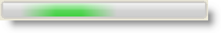
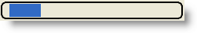
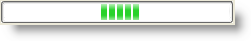

////

|metadata|
{
    "name": "winactivityindicator-styling-winactivityindicator",
    "controlName": ["WinActivityIndicator"],
    "tags": ["How Do I","Performance","Styling","Theming"],
    "guid": "{14D0C6A5-77D4-49B0-8A59-E9CA716ED501}",  
    "buildFlags": [],
    "createdOn": "0001-01-01T00:00:00Z"
}
|metadata|
////

= Styling WinActivityIndicator

The WinActivityIndicator™ control can be styled with different colors and gradients using Appearance objects and Infragistics’ very own AppStyling.

The WinActivityIndicator supports two view styles via the  pick:[win-forms="link:infragistics4.win.v{ProductVersion}~infragistics.win.ultraactivityindicator.ultraactivityindicator~viewstyle.html[ViewStyle]"]  property when OS themes are disabled (default). On operating systems that support theming, the ViewStyle property resolves to Aero. When themes are not supported on the operating system, the ViewStyle resolves to Standard.

The following example code shows some of the styling options.

This topic assumes that the control’s animation is enabled using the  pick:[win-forms="link:infragistics4.win.v{ProductVersion}~infragistics.win.ultraactivityindicator.ultraactivityindicator~animationenabled.html[AnimationEnabled]"]  property.

*In Visual Basic:*

----
Imports Infragistics.Win
Imports Infragistics.Win.UltraActivityIndicator
Imports Infragistics.Win.AppStyling
' Set Border style 
Me.ultraActivityIndicator1.BorderStyle = Infragistics.Win.UIElementBorderStyle.Rounded4Thick 
' Set ViewStyle to Aero, when Theming is disabled 
Me.ultraActivityIndicator1.ViewStyle = Infragistics.Win.UltraActivityIndicator.ActivityIndicatorViewStyle.Aero
' Set ViewStyle to Standard, when Theming is disabled 
' Me.ultraActivityIndicator1.ViewStyle = Infragistics.Win.UltraActivityIndicator.ActivityIndicatorViewStyle. Standard
' Set Appearance object 
' Me.ultraActivityIndicator1.Appearance.BackColor = Color.LightGoldenrodYellow 
' Apply Infragistics AppStyling 
'StyleManager.Load("LucidDream.isl")
' Enable Theming
' Me.ultraActivityIndicator1.UseOsThemes = Infragistics.Win.DefaultableBoolean.True
' Set ViewStyle to Standard, when Theming is enabled 
' Me.ultraActivityIndicator1.ViewStyle = Infragistics.Win.UltraActivityIndicator.ActivityIndicatorViewStyle.Standard
----

*In C#:*

----
using Infragistics.Win;
using Infragistics.Win.UltraActivityIndicator;
using Infragistics.Win.AppStyling;
// Set Border style
this.ultraActivityIndicator1.BorderStyle = Infragistics.Win.UIElementBorderStyle.Rounded4Thick;
// Set ViewStyle to Standard, when Theming is disabled
this.ultraActivityIndicator1.ViewStyle = Infragistics.Win.UltraActivityIndicator.ActivityIndicatorViewStyle.Aero;
// Set ViewStyle to Standard, when Theming is disabled
// this.ultraActivityIndicator1.ViewStyle = Infragistics.Win.UltraActivityIndicator.ActivityIndicatorViewStyle.Standard;
// Set Appearance object
// this.ultraActivityIndicator1.Appearance.BackColor = Color.LightGoldenrodYellow;
// Apply Infragistics AppStyling
//StyleManager.Load("LucidDream.isl");
// Enable Theming
//this.ultraActivityIndicator1.UseOsThemes = Infragistics.Win.DefaultableBoolean.True;
// Set ViewStyle to Standard, when Theming is enabled 
//this.ultraActivityIndicator1.ViewStyle = Infragistics.Win.UltraActivityIndicator.ActivityIndicatorViewStyle.Standard;
----

=== WinActivityIndicator with Aero View style when OS Themes is disabled.

=== WinActivityIndicator with Standard View style when OS Themes is disabled.

=== WinActivityIndicator with Standard View style when OS Themes is enabled.

== Related Topics

* link:winactivityindicator-winactivityindicator-animation.html[WinActivityIndicator Animation]
* link:winactivityindicator-marquee-animation-style-settings.html[Marquee Animation Style Settings]