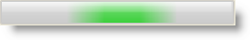

////

|metadata|
{
    "name": "winactivityindicator-winactivityindicator-animation",
    "controlName": ["WinActivityIndicator"],
    "tags": ["How Do I","Performance","Styling"],
    "guid": "{CF2C39A6-6F43-43DE-B987-355BF2461847}",  
    "buildFlags": [],
    "createdOn": "0001-01-01T00:00:00Z"
}
|metadata|
////

= WinActivityIndicator Animation

Animation on WinActivityIndicator™ can be enabled through different settings available on the control. You can set link:{ApiPlatform}win{ApiVersion}~infragistics.win.ultraactivityindicator.ultraactivityindicator~animationenabled.html[AnimationEnabled] property to True or simply call the link:{ApiPlatform}win{ApiVersion}~infragistics.win.ultraactivityindicator.ultraactivityindicator~start.html[Start] method to enable animation. The animation can be stopped by setting the AnimationEnabled property to False or calling the link:{ApiPlatform}win{ApiVersion}~infragistics.win.ultraactivityindicator.ultraactivityindicator~stop.html[Stop] method. Additionally, setting the link:{ApiPlatform}win{ApiVersion}~infragistics.win.ultraactivityindicator.ultraactivityindicator~animationspeed.html[AnimationSpeed] to 0 will also disable the animation.

When stopped, the control will continue to paint the marquee in its current state. If the animation is started again, it will resume based on the current state. The Start and Stop methods have an overload that accepts a Boolean value and that if set to True resets the animation back to its initial state. Resetting the animation back to its initial state can also be achieved using the link:{ApiPlatform}win{ApiVersion}~infragistics.win.ultraactivityindicator.ultraactivityindicator~resetanimation.html[ResetAnimation] method.

The following code assumes that you have an UltraActivityIndicator control dropped onto your form.

*In Visual Basic:*

----
' Start the Animation using the Animation Enabled property 
Me.ultraActivityIndicator1.AnimationEnabled = True 
' Start Animation using the Start method 
' this.ultraActivityIndicator1.Start() 
' Set a different speed for animation 
Me.ultraActivityIndicator1.AnimationSpeed = 50 
' Stop Animation and reset to its initial state 
' this.ultraActivityIndicator1.Stop(true) 
' Reset Animation to its intial state, when stopped and started again
Me.ultraActivityIndicator1.ResetAnimation()
----

*In C#:*

----
// Start the Animation using the Animation Enabled property
this.ultraActivityIndicator1.AnimationEnabled = true;
// Start Animation using the Start method
// this.ultraActivityIndicator1.Start();
// Set a different speed for animation
this.ultraActivityIndicator1.AnimationSpeed = 50;
// Stop Animation and reset to its initial state
// this.ultraActivityIndicator1.Stop(true);
// // Reset Animation to its intial state, when stopped and started again
this.ultraActivityIndicator1.ResetAnimation();
----

== Related Topics

* link:winactivityindicator-marquee-animation-style-settings.html[Marquee Animation Style Settings]
* link:winactivityindicator-styling-winactivityindicator.html[Styling WinActivityIndicator]