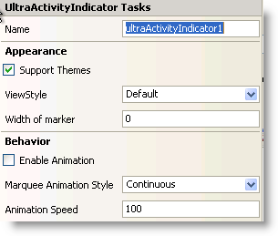

////

|metadata|
{
    "name": "winactivityindicator-winactivityindicator-smart-tag",
    "controlName": ["WinActivityIndicator"],
    "tags": ["API","Design Environment","Performance","Styling"],
    "guid": "{94BAD796-C214-412D-827C-5E39E7BD5387}",  
    "buildFlags": [],
    "createdOn": "0001-01-01T00:00:00Z"
}
|metadata|
////

= WinActivityIndicator Smart Tag

In Visual Studio 2005/2008 (.NET Framework 2.0/3.5), each Infragistics Windows Forms control/component is equipped with a Smart Tag. By simply selecting the control/component, a Smart Tag anchor appears. When you click this anchor, a pop-up panel appears, providing you with quick and easy access to the most common properties and settings of the control/component.

The WinActivityIndicator™ Smart Tag contains the name of the control, as well as the following section:

* Appearance – Provides common tasks involving the appearance, look, and feel of the control.
* Behavior – Provides easy access to properties that govern how the control behaves on the form.

See below for a description of the item (e.g., field, drop-down list, checkbox) in each section, as well as the item's corresponding property in the properties grid.

[options="header", cols="a,a,a"]
|====
|Appearance|Description|Corresponding Property

|Support Themes
|Select this check box to render the control using Microsoft OS themes.
| pick:[win-forms="link:{ApiPlatform}win.v{ProductVersion}~infragistics.win.ultracontrolbase~useosthemes.html[UseOsThemes]"] 

|ViewStyle
|Select the style to be applied on the control
| pick:[win-forms="link:infragistics4.win.v{ProductVersion}~infragistics.win.ultraactivityindicator.ultraactivityindicator~viewstyle.html[ViewStyle]"] 

|Width of Marker
|Enter a value that decides the width of the marker when the control is in Marquee mode.
| pick:[win-forms="link:infragistics4.win.v{ProductVersion}~infragistics.win.ultraactivityindicator.ultraactivityindicator~marqueemarkerwidth.html[MarqueeMarkerWidth]"] 

|====

[options="header", cols="a,a,a"]
|====
|Behavior|Description|Corresponding Property

|Enable Animation
|Select this check box to start animation on the WinActivityIndicator control.
| pick:[win-forms="link:infragistics4.win.v{ProductVersion}~infragistics.win.ultraactivityindicator.ultraactivityindicator~animationenabled.html[AnimationEnabled]"] 

|Marquee Animation Style
|Choose between the continuous and bounce-back marquee animation styles.
| pick:[win-forms="link:infragistics4.win.v{ProductVersion}~infragistics.win.ultraactivityindicator.ultraactivityindicator~marqueeanimationstyle.html[MarqueeAnimationStyle]"] 

|Animation Speed
|Choose the speed of the animation in milliseconds.
| pick:[win-forms="link:infragistics4.win.v{ProductVersion}~infragistics.win.ultraactivityindicator.ultraactivityindicator~animationspeed.html[AnimationSpeed]"] 

|====