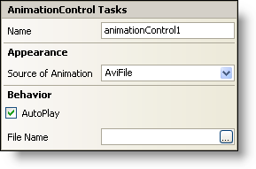

////

|metadata|
{
    "name": "winanimation-smart-tag",
    "controlName": [],
    "tags": ["Getting Started"],
    "guid": "{E4665DA6-BE24-4FE3-AFD4-0ACD890F30F3}",  
    "buildFlags": [],
    "createdOn": "2005-07-11T00:00:00Z"
}
|metadata|
////

= WinAnimation Smart Tag

In Visual Studio 2005 (.NET Framework 2.0), each Infragistics Windows Forms control/component is equipped with a Smart Tag. By simply selecting the control/component, a Smart Tag anchor appears. When you click this anchor, a pop-up panel appears, providing you with quick and easy access to the most common properties and settings of the control/component.

The WinAnimation™ Smart Tag contains the name of the control, as well as the following sections:

* Appearance -- Provides common tasks involving the appearance, look, and feel of the control.
* Behavior -- Provides easy access to properties that govern how the control behaves on the form.

See below for a description of the item (e.g., field, drop-down list, checkbox) in each section, as well as the item's corresponding property in the properties grid.

[options="header", cols="a,a,a"]
|====
|Appearance|Description|Corresponding Property

|Source of Animation
|The source of the animation can be either an AVI file or a predetermined animation based on windows defaults. Some of the windows default animations include FindFolder, FindFile, FindComputer, and several others.
| pick:[win-forms="link:infragistics4.win.misc.v{ProductVersion}~infragistics.win.misc.commoncontrols.animationcontrol~animationsource.html[AnimationSource]"] 

|====

[options="header", cols="a,a,a"]
|====
|Behavior|Description|Corresponding Property

|AutoPlay
|The control can automatically begin animating.
| pick:[win-forms="link:infragistics4.win.misc.v{ProductVersion}~infragistics.win.misc.commoncontrols.animationcontrol~autoplay.html[AutoPlay]"] 

|File Name
|By setting the AnimationSource property to AviFile, you can specify which file you want to use. This file must be an AVI file.
| pick:[win-forms="link:infragistics4.win.misc.v{ProductVersion}~infragistics.win.misc.commoncontrols.animationcontrol~filename.html[FileName]"] 

|====