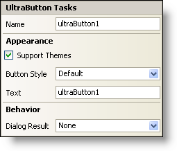

////

|metadata|
{
    "name": "winbutton-smart-tag",
    "controlName": ["WinButton"],
    "tags": ["API"],
    "guid": "{271393ED-0268-4A4B-925C-540C1A5EC9E5}",  
    "buildFlags": [],
    "createdOn": "2005-07-11T00:00:00Z"
}
|metadata|
////

= WinButton Smart Tag

In Visual Studio 2005 (.NET Framework 2.0), each Infragistics Windows Forms control/component is equipped with a Smart Tag. By simply selecting the control/component, a Smart Tag anchor appears. When you click this anchor, a pop-up panel appears, providing you with quick and easy access to the most common properties and settings of the control/component.

The WinButton™ Smart Tag contains the name of the control, as well as the following sections:

* Appearance -- Provides common tasks involving the appearance, look, and feel of the control.
* Behavior -- Provides easy access to properties that govern how the control behaves on the form.

See below for a description of the item (e.g., field, drop-down list, checkbox) in each section, as well as the item's corresponding property in the properties grid.

[options="header", cols="a,a,a"]
|====
|Appearance|Description|Corresponding Property

|Support Themes
|Select this check box to support basic Microsoft OS themes; for example, Windows Classic theme versus Windows XP theme.
| pick:[win-forms="link:{ApiPlatform}win{ApiVersion}~infragistics.win.ultracontrolbase~supportthemes.html[SupportThemes]"] 

|Button Style
|The drop-down list includes several different looks for the WinButton. If Support Themes is checked; however, you will not notice any changes as the WinButton is using the current Windows theme.
| pick:[win-forms="link:{ApiPlatform}win.misc{ApiVersion}~infragistics.win.misc.ultrabuttonbase~buttonstyle.html[ButtonStyle]"] 

|Text
|Enter the text that you want to appear on the button.
| pick:[win-forms="link:{ApiPlatform}win.misc{ApiVersion}~infragistics.win.misc.controlbase~text.html[Text]"] 

|====

[options="header", cols="a,a,a"]
|====
|Behavior|Description|Corresponding Property

|Dialog Result
|From the drop-down list, you can select a value (e.g., OK, Cancel, or Abort) that will be returned to the corresponding DialogResult property of the parent form when the button is clicked.
| pick:[win-forms="link:{ApiPlatform}win.misc{ApiVersion}~infragistics.win.misc.ultrabuttonbase~dialogresult.html[DialogResult]"] 

|====