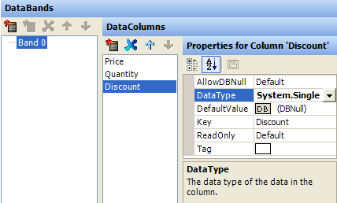
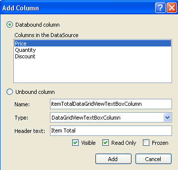
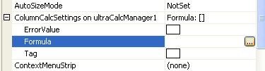
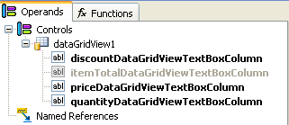
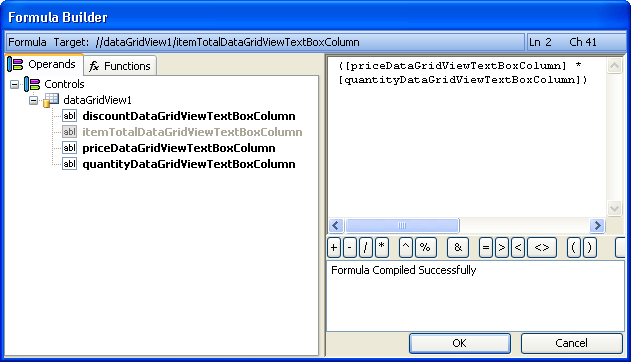
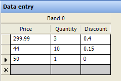
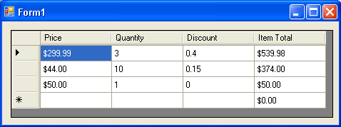

////

|metadata|
{
    "name": "wincalcmanager-creating-a-calculated-column-in-the-datagridview-control",
    "controlName": ["WinCalcManager"],
    "tags": ["How Do I"],
    "guid": "{26DA4D5C-E9CA-4EF0-A796-64C9242AD09C}",  
    "buildFlags": [],
    "createdOn": "0001-01-01T00:00:00Z"
}
|metadata|
////

= Creating a Calculated Column in the DataGridView Control

The WinCalcManager™ has the ability to do calculations inside a DataGridView column. This walk through guides you through the steps on how to this.

[start=1]
. *Set up a project with an UltraCalcManager and a DataGridView.*

Start by creating a new Windows Application in Visual Studio, in either Visual Basic .NET or C#.

Add an UltraCalcManager to the form.

Add a DataGridView to the form.
[start=2]
. *Set up a DataSource for the DataGridView.*

For the purposes of this example, you will use an UltraDataSource as the data source of the grid. But any data source can be used; it makes no difference to the CalcManager.

Add an UltraDataSource to the form.

Right-click on the UltraDataSource component and select " link:windatasource-using-the-windatasource-designer.html[UltraDataSource Designer]."

The grid will contain three columns of actual data and have an additional unbound column, which is calculated with a formula. It is possible to apply a formula to a bound column, but it generally does not make sense to store calculated values in a database.

Add a new column and change the name to "Price." Change the DataType of the column to System.Decimal.

Add a second column called "Quantity" and change its DataType to System.Int32.

Add a third column called "Discount" and change the DataType to System.Single.

 

Click Okay to exit the UltraDataSource Designer.

Set the DataSource of the DataGridView to ultraDataSource1.

Set the DataMember of the DataGridView to "Band 0"

At this point, you will see a grid and an UltraDataSource on the Form Designer with the three data columns. The next thing to do is add the unbound columns.

[start=3]
. *Add an unbound column to the DataGridView.*

Right-click on the DataGridView in the designer and select Add Column.

The Add Column dialog will appear. Select "Unbound Column."

Change the Name of the column to "itemTotalDataGridViewTextBoxColumn".

Change the Header Text of the column to "Item Total".

Check the Read Only checkbox.

 

Click the Add button.

Click the Close button.

[start=4]
. *Setting unbound column properties.*

Add the following code to the Form_Load event:

*In Visual Basic:*

----
' Format the Price and ItemTotal columns as currency.
Me.dataGridView1.Columns("priceDataGridViewTextBoxColumn"). & _ DefaultCellStyle.Format = _
  "c"
Me.dataGridView1.Columns("itemTotalDataGridViewTextBoxColumn"). & _ DefaultCellStyle.Format = _
  "c"
' Format the Discount column as a percentage.
Me.dataGridView1.Columns("priceDataGridViewTextBoxColumn"). & _ DefaultCellStyle.Format = "c"
' Set the ValueType of the ItemTotal column to Decimal.
Me.dataGridView1.Columns("itemTotalDataGridViewTextBoxColumn").ValueType = _
  GetType(System.Decimal)
----

*In C#:*

----
// Format the Price and ItemTotal columns as currency.
this.dataGridView1.Columns["priceDataGridViewTextBoxColumn"].
  DefaultCellStyle.Format = 
  "c";
this.dataGridView1.Columns["itemTotalDataGridViewTextBoxColumn"].
  DefaultCellStyle.Format = 
  "c";
// Format the Discount column as a percentage.
this.dataGridView1.Columns["priceDataGridViewTextBoxColumn"].
  DefaultCellStyle.Format = "c";
// Set the ValueType of the ItemTotal column to Decimal.
this.dataGridView1.Columns["itemTotalDataGridViewTextBoxColumn"].ValueType = 
  typeof(System.Decimal);
----

*Note:* Setting the ValueType on the bound columns is not necessary, since they pick up the type from the underlying data source.

[start=5]
. *Create a Formula for the unbound column (part 1 of 2)*

*Note:* For this step, use the Properties Window in Visual Studio. You can edit columns in the DataGridView by right-clicking the grid in the designer and selecting Edit Columns to bring up the column editor, but this dialog does not display extender properties.

In the Properties window in Visual Studio, drop down the list and select itemTotalDataGridViewTextBoxColumn.

Find the ColumnCalcSettings on UltraCalcManager1 property and expand it.

Go to the Formula property and click the ellipsis (...) to bring up the FormulaBuilder.

On the left-hand side you will see the Operands list. Click on the "Controls" node and press the asterisk ($$*$$) on the numeric keypad of your keyboard. This will expand the entire tree. You will see the DataGridView and the four columns in the grid.

Notice that the unbound column in the list is grayed out. This is because " itemTotalDataGridViewTextBoxColumn" is the column whose formula is being edited. A formula that references itself creates a circular reference, and so the node is disabled. There are some special cases where a column will refer to itself; those special cases are discussed elsewhere in the UltraCalcManager documentation.

The formula for this column will multiply Price times Quantity and then apply the Discount as a percentage.

The first thing to do is multiply Price times Quantity. There are two ways to do this: the standard multiplication operator ($$*$$), or the product function.

*Using the multiplication operator*

The first thing to do is insert a reference to the Price column into the Formula window. There are three ways to do this:

*** Double-click on the priceDataGridViewTextBoxColumn node in the Operands tree.
*** Right-click on the Formula window and select "Insert Operand" and then drill down the menus to get to priceDataGridViewTextBoxColumn.
*** Type directly into the Formula window.

Regardless of the method used, the formula should contain this text:

[source]
----
[priceDataGridViewTextBoxColumn]
----

Next, add the multiplication operator. Either click the $$*$$ button (in the row of buttons under the Formula window), or type an asterisk at the appropriate place.

Then add the quantityDataGridViewTextBoxColumn reference the same way you added priceDataGridViewTextBoxColumn.

The formula should now look like this:

[source]
----
[priceDataGridViewTextBoxColumn] * [priceDataGridViewTextBoxColumn]
----

Proceed to the next step to finish building this formula.

**Using the product function.*

... Switch to the Functions tab.
... Expand the Math category.
... Scroll down until you find the product function and double-click it. This will bring up the function builder.
... In the operands list on the left, find the priceDataGridViewTextBoxColumn column and double-click it. "[priceDataGridViewTextBoxColumn]" appears in the first argument box after the heading, "number0".
... Double-click on the priceDataGridViewTextBoxColumn node to add "[priceDataGridViewTextBoxColumn]" as the second argument.
... Click OK on the Function Builder dialog.

Your formula should now look like this:

[source]
----
product ( [priceDataGridViewTextBoxColumn], [quantityDataGridViewTextBoxColumn] )
----

Proceed to the next step to finish building this formula.

[start=6]
. *Create a Formula for the unbound column (part 2of 2).*

Notice that the Formula status window on the bottom right shows that the Formula has compiled successfully. This indicates that the formula is valid as-is, but it does not yet account for the discount.

There are a variety of ways to design this formula. Finish it up by multiplying 1 minus the discount. Here are some examples of what your formula might look like; these are all valid:

[source]
----
([priceDataGridViewTextBoxColumn] * [quantityDataGridViewTextBoxColumn]) * (1-[discountDataGridViewTextBoxColumn])
----

[source]
----
(product ( [priceDataGridViewTextBoxColumn],[quantityDataGridViewTextBoxColumn] )) * (1-[discountDataGridViewTextBoxColumn])
----

[source]
----
product ( (product ( [priceDataGridViewTextBoxColumn],[quantityDataGridViewTextBoxColumn] )) , (1-[discountDataGridViewTextBoxColumn]))
----

When you are done, click OK on the FormulaBuilder dialog. The Formula you created is now displayed in the Formula property of the grid columns.
[start=7]
. *Provide some data.*

There is one more thing to do before running the application. In order to perform calculations, the CalcManager will need some data to calculate. Right-click on the UltraDataSource and select UltraDataSource Designer.

Click the Data Entry node and enter some dummy data. Add about 10 rows to the grid with data in each row. If you leave some cells in the grid empty, they will be treated as zeros by the CalcManager.

[start=8]
. *Run the application and observe the results.*

Calculations can be seen in the fourth column. Change some of the cell values at run-time, and the Item Total column is automatically updated as soon as focus leaves the changed cell.

