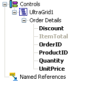
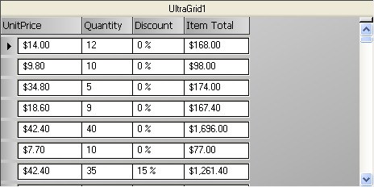

////

|metadata|
{
    "name": "wincalcmanager-creating-a-calculated-column-in-wingrid",
    "controlName": ["WinCalcManager"],
    "tags": ["How Do I"],
    "guid": "{B863BD3A-AAC3-4BE0-8DD0-C613026A9988}",  
    "buildFlags": [],
    "createdOn": "0001-01-01T00:00:00Z"
}
|metadata|
////

= Creating a Calculated Column in WinGrid

== Before You Begin:

The WinCalcManager™ has the ability to do calculations inside a WinGrid™ column. This walk through guides you through the steps on how to this.

== Follow These Steps:

[start=1]
. Set up a project with WinCalcManager and WinGrid. Start by creating a new Windows Application in Visual Studio, in either Visual Basic .NET or C#. Add an UltraCalcManager and UltraWinGrid to the form.
[start=2]
. Next you need to data bind the WinGrid, for information on how to do this you can review the  pick:[win-forms="link:wingrid-binding-wingrid-to-a-flat-data-source-clr2.html[Bind WinGrid to a Flat Data Source]"]  topic. This topic uses the Order Details table in the Northwind database for its data. The Northwind Database (Nwind.mdb) is available as part of the Infragistics Professional SDK install. By default, the NWind.mdb file is located in the following installation folder, depending on your operating system:

** XP -- {InstallPathXP}{ProductNameVersion}\Samples\Win\Data
** Vista -- {InstallPathVista}{ProductNameVersion}\Samples\Win\Data

[start=3]
. Now that the grid's data source is set up, the next thing to do is to create an unbound column for the calculation. Add an unbound column to the WinGrid. Right-click the WinGrid and select "UltraGrid Designer" to launch the grid designer.
[start=4]
. In the WinGrid designer, drill down to the node: "Band and Column Settings> Band[0] - 'Order Details' >Columns."Selecting this node will display the columns available in this band in the middle pane.

[start=5]
. At the bottom click the button labeled "Add Unbound Column to add an new column to the band.

[start=6]
. Change the Key of the Column to "ItemTotal". Change the Header.Caption of the column to "Item Total". Change the DataType of the column to System.Decimal.

[start=7]
. Just to make things look a little neater, set the  pick:[win-forms="link:{ApiPlatform}win.ultrawingrid{ApiVersion}~infragistics.win.ultrawingrid.ultragridcolumn~format.html[Format]"]  property on the UnitPrice and Item Total columns to c2, and set the Format of the Discount column to "p0" to make it show as a percentage. Also, set the  pick:[win-forms="link:{ApiPlatform}win.ultrawingrid{ApiVersion}~infragistics.win.ultrawingrid.ultragridcolumn~hidden.html[Hidden]"]  property of the OrderID and ProductID columns to True.
[start=8]
. To create a Formula for the unbound column go to the  pick:[win-forms="link:{ApiPlatform}win.ultrawingrid{ApiVersion}~infragistics.win.ultrawingrid.ultragridcolumn~formula.html[Formula]"]  property of the Item Total column and click the ellipsis (...) to bring up the FormulaBuilder.

On the left-hand side you will see the Operands list. Click on the "Controls" node and press the asterisk ($$*$$) on the numeric keypad of your keyboard. This will expand the entire tree. You will see the UltraGrid1, its single band (Order Details), and the six columns in the grid.

Notice that the unbound column in the list is grayed out. This is because "Item Total" is the column whose formula is being edited. A formula that references itself creates a circular reference, and so the node is disabled.
[start=9]
. The formula for this column will multiply UnitPrice times Quantity and then apply the Discount as a percentage. The first thing to do is multiply UnitPrice times Quantity. There are two ways to do this: the standard multiplication operator ($$*$$), or the product function. We'll show you the standard multiplication operator way.

The first thing to do is insert a reference to the UnitPrice column into the Formula window. There are three ways to do this:

* Double-click on the UnitPrice node in the Operands tree.
* Right-click on the Formula window and select "Insert Operand" and then drill down the menus to get to UnitPrice.
* Type directly into the Formula window.

[start=10]
. Next, add the multiplication operator. Either click the $$*$$ button (in the row of buttons under the Formula window), or type an asterisk at the appropriate place.
[start=11]
. Then add the Quantity reference the same way you added UnitPrice.

Notice that the Formula status window on the bottom right shows that the Formula has compiled successfully. This indicates that the formula is valid as-is, but it does not yet account for the discount.
[start=12]
. There are a variety of ways to design this formula. Finish it up by multiplying 1 minus the discount. Here are some examples of what your formula might look like; these are all valid:

image::images/WinCalcManager_Creating_a_Calculated_Column_in_the_WinGrid_06.png[ultracalcmanager's formula builder dialog zoomed in on formula editing area]

[start=13]
. When you are done, click OK on the FormulaBuilder dialog. The Formula you created is now displayed in the Formula property of the grid columns.

Click Apply to save your settings you've made in the designer. Then click OK to exit the grid designer.
[start=14]
. Run the application and observe the results.

== What You Accomplished:

This walk through was designed to guide you through the process of using the WinCalcManager to create a calculated column in the WinGrid.