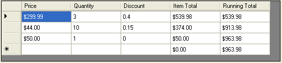

////

|metadata|
{
    "name": "wincalcmanager-creating-a-running-total-in-the-datagridview-control",
    "controlName": ["WinCalcManager"],
    "tags": ["How Do I"],
    "guid": "{07C0A727-DCDC-4620-8598-D7B94E6044F5}",  
    "buildFlags": [],
    "createdOn": "0001-01-01T00:00:00Z"
}
|metadata|
////

= Creating a Running Total in the DataGridView Control

This tutorial assumes that you have completed part one ( link:wincalcmanager-creating-a-calculated-column-in-the-datagridview-control.html[Creating a Calculated Column in the DataGridView Control]) and are using the resulting test project you created. Begin by opening the test project in Visual Studio .NET.

In this tutorial, you will create a running total column in the grid. The running total will display the total of the "Item Total" column (which is itself a calculated column) for the current row and all rows above, but not below it.

[start=1]
. *Add an unbound column to the grid.*

Right-click on the DataGridView in the designer and select Add Column.

The Add Column dialog will appear. Select "Unbound Column."

Change the Name of the column to "runningTotalDataGridViewTextBoxColumn".

Change the Header Text of the column to "Running Total".

Check the Read Only checkbox.

Click the Add button.

Click the Close button.
[start=2]
. *Setting unbound column properties.*

Add the following code to the Form_Load event:

*In Visual Basic:*

----
' Format the Running Total column as currency.
Me.dataGridView1.Columns("runningTotalDataGridViewTextBoxColumn"). & _ 
  DefaultCellStyle.Format _
  = "c"
' Set the ValueType of the Running Total column to Decimal.
Me.dataGridView1.Columns("runningTotalDataGridViewTextBoxColumn").ValueType = _
  GetType(System.Decimal)
----

*In C#:*

----
// Format the Running Total column as currency.
this.dataGridView1.Columns["runningTotalDataGridViewTextBoxColumn"]. 
  DefaultCellStyle.Format 
  = "c";
// Set the ValueType of the Running Total column to Decimal.
this.dataGridView1.Columns["runningTotalDataGridViewTextBoxColumn"].ValueType = 
  typeof(System.Decimal);
----

[start=3]
. *Set up the column formula to display a running total.*

.Note
[NOTE]
====
For this step, use the Properties Window in Visual Studio. You can edit columns in the DataGridView by right-clicking the grid in the designer and selecting Edit Columns to bring up the column editor, but this dialog does not display extender properties.
====

In the Properties window in Visual Studio, drop down the list and select runningTotalDataGridViewTextBoxColumn.

Find the ColumnCalcSettings on UltraCalcManager1 property and expand it.

There are two basic ways to achieve a running total effect:

*Method 1 -- The simpler, less efficient way*

This method uses the sum function on a range of cells within the column from row 0 (the first row in the grid) to the current row.

The problem with this method is that the sum of all the previous cells is recalculated for each cell. This is fine if using a relatively small number of rows; but with a large data set, the calculations may be too slow.

Switch to the Functions tab, open the Math category and double-click the sum function.

This function takes at least one argument and can take an indefinite number of arguments. In this case, you will be specifying only one argument, but that argument will be a range of cells from the first row to the current row in the "Item Total" column. This is done by using the colon (:) symbol, just like in Microsoft Excel.

Click into the Number0 argument box and enter this text:

[source]
----
[itemTotalDataGridViewTextBoxColumn(0)] : [itemTotalDataGridViewTextBoxColumn]
----

This specifies a range of cells in the Item Total column from row 0 (the first row in the grid) to the current row.

Click OK to close the Formula Builder and OK again to close the grid designer.

Run the application and you will see your running total column is fully functional. Once again, you can update the values of cells in the grid and the Item Total and Running Total will automatically update as soon as the changed cell loses focus.

*Method 2 -- The more complex, but more efficient way*

A more efficient way to do this is to simply take the total in the previous row of the "Running Total" column and add the "Item Total" from the current row. To achieve this, it is necessary to reference a relative row. This is done by specifying a relative row index, as in this formula:

[source]
----
[itemTotalDataGridViewTextBoxColumn] + [runningTotalDataGridViewTextBoxColumn (-1)]
----

This appears very simply at first glance, but it will not actually work. The reason is that referring to a relative row will cause an error if the row does not exist. The first row in the grid has no prior sibling, so this formula will cause a reference error.

To get around this, use the if function and the iserror function to check for an error and return either 0 (if there is an error) or the value of the previous cell (if there is no error). The finished formula looks like this:

----
[itemTotalDataGridViewTextBoxColumn] + 
if	
(
   iserror ( [runningTotalDataGridViewTextBoxColumn (-1)] ), 
   0, 
   [runningTotalDataGridViewTextBoxColumn (-1)] 
)
----

This formula is displayed here with line breaks so it is easier to read, but note that they are not necessary for the formula to compile.

Click OK to close the Formula Builder and OK again to close the grid designer.

Run the application and you will see your running total column is fully functional. Once again, you can update the values of cells in the grid and the Item Total and Running Total will automatically update as soon as the changed cell loses focus.

