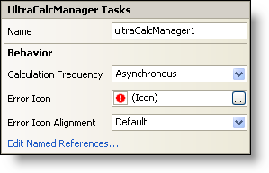

////

|metadata|
{
    "name": "wincalcmanager-smart-tag",
    "controlName": ["WinCalcManager"],
    "tags": ["Design Environment","Extending"],
    "guid": "{19BD56E5-3FC1-4938-B7D2-EA856305757F}",  
    "buildFlags": [],
    "createdOn": "2005-09-11T00:00:00Z"
}
|metadata|
////

= WinCalcManager Smart Tag

In Visual Studio 2005 (.NET Framework 2.0), each Infragistics Windows Forms control/component is equipped with a Smart Tag. By simply selecting the control/component, a Smart Tag anchor appears. When you click this anchor, a pop-up panel appears, providing you with quick and easy access to the most common properties and settings of the control/component.

The WinCalcManager™ Smart Tag contains the name of the component, as well as the following section:

* Behavior -- Provides easy access to properties that govern how the control behaves on the form.

See below for a description of the item (e.g., field, drop-down list, checkbox) in each section, as well as the item's corresponding property in the properties grid.

[options="header", cols="a,a,a"]
|====
|Behavior|Description|Corresponding Property

|Calculation Frequency
|This item determines how frequent WinCalcManager will make calculations. Choose from Asynchronous, Synchronous, or Manual.
| pick:[win-forms="link:infragistics4.win.ultrawincalcmanager.v{ProductVersion}~infragistics.win.ultrawincalcmanager.ultracalcmanager~calcfrequency.html[CalcFrequency]"] 

|Error Icon
|When WinCalcManager has trouble calculating a formula, an error dialog will appear displaying this icon. To change the icon, click the ellipsis (...). An open file dialog will appear, allowing you to select an icon file ($$*$$.ico).
| pick:[win-forms="link:infragistics4.win.ultrawincalcmanager.v{ProductVersion}~infragistics.win.ultrawincalcmanager.ultracalcmanager~erroricon.html[ErrorIcon]"] 

|Error Icon Alignment
|Choose from six locations to place the error icon on the error dialog.
| pick:[win-forms="link:infragistics4.win.ultrawincalcmanager.v{ProductVersion}~infragistics.win.ultrawincalcmanager.ultracalcmanager~erroriconalignment.html[ErrorIconAlignment]"] 

|Edit Named References
|A named reference is essentially a constant variable that you can set and then use in calculations. There is a NamedReferences collection that contains all of these variables. Click the ellipsis (...) to add or edit a named reference.
| pick:[win-forms="link:infragistics4.win.ultrawincalcmanager.v{ProductVersion}~infragistics.win.ultrawincalcmanager.ultracalcmanager~namedreferences.html[NamedReferences]"] 

|====