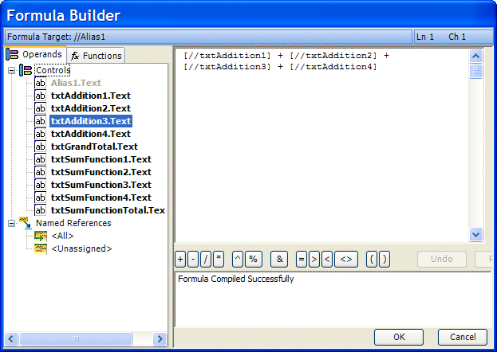

////

|metadata|
{
    "name": "wincalcmanager-whats-new-2005-1",
    "controlName": [],
    "tags": [],
    "guid": "{9FF916ED-51DD-4481-BD1D-CB64B010F745}",  
    "buildFlags": [],
    "createdOn": "0001-01-01T00:00:00Z"
}
|metadata|
////

= WinCalcManager 2005.1

== FormulaBuilder Can Be Utilized At Run-Time

The FormulaBuilder can be used for both design-time developer input and link:wincalcmanager-using-formulabuilder-at-run-time.html[run-time] user input.

