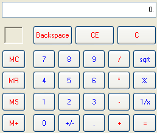

////

|metadata|
{
    "name": "wincalculator-about-wincalculator",
    "controlName": ["WinCalculator"],
    "tags": ["Getting Started","Summaries"],
    "guid": "{2FFC7AC9-0D20-488E-AA1B-FE4A9D2417F0}",  
    "buildFlags": [],
    "createdOn": "0001-01-01T00:00:00Z"
}
|metadata|
////

= About WinCalculator

The WinCalculator™ control is a customizable calculator with the following features:

* Appearance support -- Full Appearance support including alpha-blending, gradients, images, etc.
* Built-in theming -- Supports Standard, Office 2000, Office XP, Office 2003, Visual Studio 2005, and Office 2007 themes.
* Customizable actions -- Calculator button events and custom calculator buttons allow developer-specified calculations to fit business rules.

