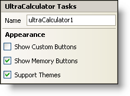

////

|metadata|
{
    "name": "wincalculator-smart-tag",
    "controlName": ["WinCalculator"],
    "tags": ["Styling"],
    "guid": "{295918D5-31B9-4CFA-8A76-9CE0F60F5F71}",  
    "buildFlags": [],
    "createdOn": "2005-09-11T00:00:00Z"
}
|metadata|
////

= WinCalculator Smart Tag

In Visual Studio 2005 (.NET Framework 2.0), each Infragistics Windows Forms control/component is equipped with a Smart Tag. By simply selecting the control/component, a Smart Tag anchor appears. When you click this anchor, a pop-up panel appears, providing you with quick and easy access to the most common properties and settings of the control/component.

The WinCalculator™ Smart Tag contains the name of the control, as well as the following section:

* Appearance -- Provides common tasks involving the appearance, look, and feel of the control.

See below for a description of the item (e.g., field, drop-down list, checkbox) in each section, as well as the item's corresponding property in the properties grid.

[options="header", cols="a,a,a"]
|====
|Appearance|Description|Corresponding Property

|Show Custom Buttons
|Selecting this checkbox will show a group of six extra buttons that you can customize.
| pick:[win-forms="link:{ApiPlatform}win.ultrawineditors{ApiVersion}~infragistics.win.ultrawineditors.ultrawincalc.ultracalculator~showcustombuttons.html[ShowCustomButtons]"] 

|Show Memory Buttons
|Select this checkbox to show the memory buttons (memory clear, memory recall, memory store, and memory +).
| pick:[win-forms="link:{ApiPlatform}win.ultrawineditors{ApiVersion}~infragistics.win.ultrawineditors.ultrawincalc.ultracalculator~showmemorybuttons.html[ShowMemoryButtons]"] 

|Support Themes
|Select this checkbox to support basic Microsoft OS themes; for example, Windows Classic theme versus Windows XP theme.
| pick:[win-forms="link:{ApiPlatform}win{ApiVersion}~infragistics.win.ultracontrolbase~supportthemes.html[SupportThemes]"] 

|====