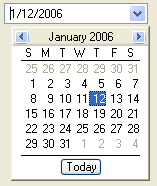

////

|metadata|
{
    "name": "wincalendarcombo-about-wincalendarcombo",
    "controlName": ["WinCalendarCombo"],
    "tags": ["Getting Started"],
    "guid": "{048E2252-1851-4675-926A-AE31CE40F462}",  
    "buildFlags": [],
    "createdOn": "0001-01-01T00:00:00Z"
}
|metadata|
////

= About WinCalendarCombo

The WinCalendarCombo™ is a Windows Forms control that provides a drop-down calendar that returns the selected date to an editor interface.

* Appearance support -- Full appearance support including alpha-blending, gradients, images, etc.
* Spin button functionality -- Full support for using spin buttons to increment values.
* Customizable header -- Ability to customize the header that shows at the top of the drop-down list.
* WinSchedule functionality -- Can make use of WinCalendarInfo and WinCalendarLook.

