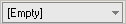

////

|metadata|
{
    "name": "wincalendarcombo-set-the-text-of-wincalendarcombo-when-the-date-value-is-null",
    "controlName": ["WinCalendarCombo"],
    "tags": ["How Do I"],
    "guid": "{7C85955E-8EC8-4BDF-90EB-BE19C62B15F3}",  
    "buildFlags": [],
    "createdOn": "2005-07-07T00:00:00Z"
}
|metadata|
////

= Set the Text of WinCalendarCombo When the Date Value is Null

By default the WinCalendarCombo™ allows the  pick:[win-forms="link:{ApiPlatform}win.ultrawinschedule{ApiVersion}~infragistics.win.ultrawinschedule.ultracalendarcombo~value.html[Value]"]  to be cleared out. The string shown when the Value property has been cleared out is decided based on the  pick:[win-forms="link:{ApiPlatform}win.ultrawinschedule{ApiVersion}~infragistics.win.ultrawinschedule.ultracalendarcombo~nulldatelabel.html[NullDateLabel]"]  property. By default it is set to "(none)", though you can change this to whatever you want.

The following example code shows how to set this property.

.Note
[NOTE]
====
In order to see the string get displayed in the WinCalenderCombo the control must lose focus.
====

*In Visual Basic:*

----
Private Sub Set_the_Text_of_WinCalendarCombo_When_the_Date_Value_is_Null_Load( _
  ByVal sender As Object, _
  ByVal e As System.EventArgs) Handles MyBase.Load
	Me.UltraCalendarCombo1.NullDateLabel = "[Empty]"
End Sub
----

*In C#:*

----
private void Set_the_Text_of_WinCalendarCombo_When_the_Date_Value_is_Null_Load(
  object sender, EventArgs e)
{
	this.ultraCalendarCombo1.NullDateLabel = "[Empty]";
}
----

