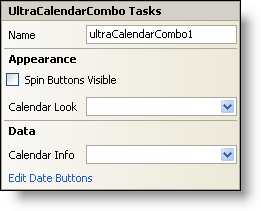

////

|metadata|
{
    "name": "wincalendarcombo-smart-tag",
    "controlName": ["WinCalendarCombo"],
    "tags": ["Getting Started","How Do I"],
    "guid": "{8B6AAB12-5136-472A-932C-0DF7109A5BE0}",  
    "buildFlags": [],
    "createdOn": "0001-01-01T00:00:00Z"
}
|metadata|
////

= WinCalendarCombo Smart Tag

In Visual Studio 2005 (.NET Framework 2.0), each Infragistics Windows Forms control/component is equipped with a Smart Tag. By simply selecting the control/component, a Smart Tag anchor appears. When you click this anchor, a pop-up panel appears, providing you with quick and easy access to the most common properties and settings of the control/component.

The WinCalendarCombo™ Smart Tag contains the name of the control, as well as the following sections:

* Appearance -- Provides common tasks involving the appearance, look, and feel of the control.
* Data -- Refers to any underlying data the control is using such as data sources and data members.

See below for a description of the item (e.g., field, drop-down list, checkbox) in each section, as well as the item's corresponding property in the properties grid.

[options="header", cols="a,a,a"]
|====
|Appearance|Description|Corresponding Property

|Spin Buttons Visible
|Selecting this check box will display two very small up and down arrows to the right of the control. The user can make incremental changes to the date with these buttons.
| pick:[win-forms="link:infragistics4.win.ultrawinschedule.v{ProductVersion}~infragistics.win.ultrawinschedule.ultracalendarcombo~spinbuttonsvisible.html[SpinButtonsVisible]"] 

|Calendar Look
|Upon clicking the drop-down, all available WinCalendarLook controls on the form will be displayed.
| pick:[win-forms="link:infragistics4.win.ultrawinschedule.v{ProductVersion}~infragistics.win.ultrawinschedule.ultraschedulecontrolbase~calendarlook.html[CalendarLook]"] 

|====

[options="header", cols="a,a,a"]
|====
|Data|Description|Corresponding Property

|Calendar Info
|Upon clicking the drop-down, all available WinCalendarInfo controls on the form will be displayed.
| pick:[win-forms="link:infragistics4.win.ultrawinschedule.v{ProductVersion}~infragistics.win.ultrawinschedule.ultraschedulecontrolbase~calendarinfo.html[CalendarInfo]"] 

|Edit Date Buttons
|In the drop-down calendar of the WinCalendarCombo, there is a button at the bottom of the calendar called "Today." This is a date button, and can be modified by clicking Edit Date Buttons. This will open the DateButton collection editor. Here, you can also add more buttons to the calendar.
| pick:[win-forms="link:infragistics4.win.ultrawinschedule.v{ProductVersion}~infragistics.win.ultrawinschedule.ultracalendarcombo~datebuttons.html[DateButtons]"] 

|====