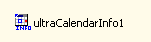

////
|metadata|
{
    "name": "wincalendarinfo-about-wincalendarinfo",
    "controlName": ["WinCalendarInfo"],
    "tags": ["Getting Started"],
    "guid": "{8F897C80-B7FC-4A11-905C-649121830F73}",
    "buildFlags": [],
    "createdOn": "0001-01-01T00:00:00Z"
}
|metadata|
////

= About WinCalendarInfo

WinCalendarInfo™ is a Windows Forms component that works with the different views of the WinSchedule™ controls and components by providing data and allowing for data manipulation.

* Schedule manipulation -- Controls the visible days on any of the WinSchedule views bound to it.
* Data manipulation -- Handles serialization of appointments, notes, etc. This serialization is handled between different WinSchedule views.
* Owners -- Controls the available owners that are displayed in a WinSchedule view.
* Active Day -- Sets the active day on all the WinSchedule views.

