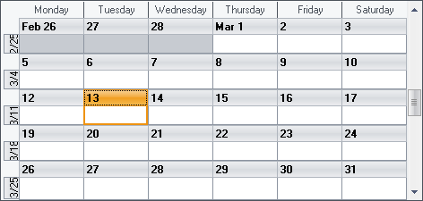

////

|metadata|
{
    "name": "wincalendarinfo-hide-a-day-of-the-week",
    "controlName": ["WinSchedule"],
    "tags": [],
    "guid": "{1DC51906-B522-4541-BDC9-613607CF0429}",  
    "buildFlags": [],
    "createdOn": "2005-07-07T00:00:00Z"
}
|metadata|
////

= Hide a Day of the Week

WinCalendarInfo™ can be used to hide a day of the week across multiple WinSchedule™ views. The procedure to do this doesn't matter which view you are using, as the change is made to the WinCalendarInfo not the individual view.

The example code below assumes you have a WinCalendarInfo on your form called UltraCalendarInfo1, and at least one of the WinSchedule views as well. The WinSchedule view has its  pick:[win-forms="link:{ApiPlatform}win.ultrawinschedule{ApiVersion}~infragistics.win.ultrawinschedule.ultraschedulecontrolbase~calendarinfo.html[CalendarInfo]"]  property set to the UltraCalendarInfo1 that is on your form.

*In Visual Basic:*

----
Imports Infragistics.Win.UltraWinSchedule
...
Private Sub Hide_a_Day_of_the_Week_Load( _
  ByVal sender As System.Object, ByVal e As System.EventArgs) Handles MyBase.Load
	Me.UltraCalendarInfo1.DaysOfWeek(DayOfWeekEnum.Sunday).Visible = False
End Sub
----

*In C#:*

----
using Infragistics.Win.UltraWinSchedule;
...
private void Hide_a_Day_of_the_Week_Load(object sender, EventArgs e)
{
	this.ultraCalendarInfo1.DaysOfWeek[DayOfWeekEnum.Sunday].Visible = false;
}
----

If you used this code along with the WinMonthViewSingle the result would be similar to the following screen shot. Notice how the column for Sunday is not shown at all.

