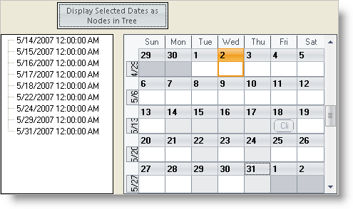

////

|metadata|
{
    "name": "wincalendarinfo-list-all-days-in-the-selected-date-ranges",
    "controlName": ["WinCalendarInfo"],
    "tags": ["How Do I"],
    "guid": "{332E0FF0-59D4-4379-911C-5C239EBA4A9A}",  
    "buildFlags": [],
    "createdOn": "2005-07-07T00:00:00Z"
}
|metadata|
////

= List All Days in the Selected Date Ranges

The WinCalendarInfo™ has a  pick:[win-forms="link:{ApiPlatform}win.ultrawinschedule{ApiVersion}~infragistics.win.ultrawinschedule.ultracalendarinfo~selecteddateranges.html[SelectedDateRanges]"]  collection, which contains all the selected dates that your end-user have made. You can loop over this collection and display the dates, for example, you can display the end-user selected dates as nodes in the WinTree™.

[start=1]
. Before you start writing any code, you should place using/imports directives in your code-behind so you don't need to always type out a member's fully qualified name.

*In Visual Basic:*

----
Imports Infragistics.Win.UltraWinSchedule
----

*In C#:*

----
using Infragistics.Win.UltraWinSchedule;
----

[start=2]
. Place on your form a UltraButton, UltraTree, UltraCalendarInfo, and UltraMonthViewSingle from your Visual Studio Toolbox. The UltraCalendarInfo is a non-visual component that places itself on the component tray.
[start=3]
. Set the UltraButton's Name property to "btnSelectedDates". In addition, specify the UltraButton's Text property to say "Disable Select Dates as Nodes in Tree".
[start=4]
. Set the UltraMonthViewSingle's  pick:[win-forms="link:{ApiPlatform}win.ultrawinschedule{ApiVersion}~infragistics.win.ultrawinschedule.ultraschedulecontrolbase~calendarinfo.html[CalendarInfo]"]  property to the UltraCalendarInfo instance you have placed on your form.
[start=5]
. In the btnSelectedDates click event, place the following example code. This code clears the tree's nodes collection, then loops over the UltraCalendarInfo's SelectedDateRanges collection. It then loops over every SelectedDateRanges Days collection, and adds them as nodes to the UltraTree.

*In Visual Basic:*

----
Private Sub btnSelectedDates_Click(ByVal sender As System.Object, _
  ByVal e As System.EventArgs) Handles btnSelectedDates.Click
	Me.UltraTree1.Nodes.Clear()
	Dim oRange As DateRange
	For Each oRange In Me.UltraCalendarInfo1.SelectedDateRanges
		Dim oDay As Infragistics.Win.UltraWinSchedule.Day
		For Each oDay In oRange.Days
			Me.UltraTree1.Nodes.Add(oDay.Date.ToString(), _
			  oDay.Date.ToString())
		Next oDay
	Next oRange
End Sub
----

*In C#:*

----
private void btnSelectedDates_Click(object sender, EventArgs e)
{
	this.ultraTree1.Nodes.Clear();
	foreach (DateRange oRange in this.ultraCalendarInfo1.SelectedDateRanges)
	{
		foreach (Infragistics.Win.UltraWinSchedule.Day oDay in oRange.Days)
		{
			this.ultraTree1.Nodes.Add(oDay.Date.ToString(), 
			  oDay.Date.ToString());
		}
	}
}
----

[start=6]
. Build and run the form. Select some days on the WinMonthViewSingle (hold down the Shift or Ctrl key to select multiple dates), and click the button to display them in the tree.

