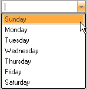

////

|metadata|
{
    "name": "wincalendarinfo-populate-a-combo-box-with-the-days-of-the-week",
    "controlName": ["WinCalendarInfo"],
    "tags": ["Application Scenarios"],
    "guid": "{73EC94AB-CF41-4BC5-BB10-D589748AF0A3}",  
    "buildFlags": [],
    "createdOn": "2005-07-07T00:00:00Z"
}
|metadata|
////

= Populate a Combo Box With the Days of the Week

You can easily populate a combo box control's drop-down list with the days of the week by using the WinCalendarInfo™. By using the  pick:[win-forms="link:{ApiPlatform}win.ultrawinschedule{ApiVersion}~infragistics.win.ultrawinschedule.dayofweek~longdescriptionresolved.html[LongDescriptionResolved]"]  property, the system's locale settings will be used unless the  pick:[win-forms="link:{ApiPlatform}win.ultrawinschedule{ApiVersion}~infragistics.win.ultrawinschedule.dayofweek~longdescription.html[LongDescription]"]  property has been explicitly set.

The following example code shows one way to go about populating the WinComboEditor™  pick:[win-forms="link:{ApiPlatform}win.ultrawineditors{ApiVersion}~infragistics.win.ultrawineditors.ultracomboeditor~items.html[Items]"]  collection with each day of the week.

*In Visual Basic:*

----
Imports Infragistics.Win.UltraWinSchedule
...
Private Sub Populate_a_Combo_Box_With_the_Days_of_the_Week_Load( _
  ByVal sender As System.Object, _
  ByVal e As System.EventArgs) Handles MyBase.Load
	' Clear the Text property and items collection
	Me.UltraComboEditor1.Text = ""
	Me.UltraComboEditor1.Items.Clear()
	' Add each day of the week to the combo box's drop-down list
	Me.UltraComboEditor1.Items.Add( _
	  Me.UltraCalendarInfo1.DaysOfWeek(DayOfWeekEnum.Sunday).LongDescriptionResolved)
	Me.UltraComboEditor1.Items.Add( _
	  Me.UltraCalendarInfo1.DaysOfWeek(DayOfWeekEnum.Monday).LongDescriptionResolved)
	Me.UltraComboEditor1.Items.Add( _
	  Me.UltraCalendarInfo1.DaysOfWeek(DayOfWeekEnum.Tuesday).LongDescriptionResolved)
	Me.UltraComboEditor1.Items.Add( _
	  Me.UltraCalendarInfo1.DaysOfWeek(DayOfWeekEnum.Wednesday).LongDescriptionResolved)
	Me.UltraComboEditor1.Items.Add( _
	  Me.UltraCalendarInfo1.DaysOfWeek(DayOfWeekEnum.Thursday).LongDescriptionResolved)
	Me.UltraComboEditor1.Items.Add( _
	  Me.UltraCalendarInfo1.DaysOfWeek(DayOfWeekEnum.Friday).LongDescriptionResolved)
	Me.UltraComboEditor1.Items.Add( _
	  Me.UltraCalendarInfo1.DaysOfWeek(DayOfWeekEnum.Saturday).LongDescriptionResolved)
End Sub
----

*In C#:*

----
using Infragistics.Win.UltraWinSchedule;
...
private void Populate_a_Combo_Box_With_the_Days_of_the_Week_Load( 
  object sender, EventArgs e)
{
	// Clear the Text property and items collection
	this.ultraComboEditor1.Text = "";
	this.ultraComboEditor1.Items.Clear();
	// Add each day of the week to the combo box's drop-down list
	this.ultraComboEditor1.Items.Add(
	  this.ultraCalendarInfo1.DaysOfWeek[DayOfWeekEnum.Sunday].LongDescriptionResolved);
	this.ultraComboEditor1.Items.Add(
	  this.ultraCalendarInfo1.DaysOfWeek[DayOfWeekEnum.Monday].LongDescriptionResolved);
	this.ultraComboEditor1.Items.Add(
	  this.ultraCalendarInfo1.DaysOfWeek[DayOfWeekEnum.Tuesday].LongDescriptionResolved);
	this.ultraComboEditor1.Items.Add(
	  this.ultraCalendarInfo1.DaysOfWeek[DayOfWeekEnum.Wednesday].LongDescriptionResolved);
	this.ultraComboEditor1.Items.Add(
	  this.ultraCalendarInfo1.DaysOfWeek[DayOfWeekEnum.Thursday].LongDescriptionResolved);
	this.ultraComboEditor1.Items.Add(
	  this.ultraCalendarInfo1.DaysOfWeek[DayOfWeekEnum.Friday].LongDescriptionResolved);
	this.ultraComboEditor1.Items.Add(
	  this.ultraCalendarInfo1.DaysOfWeek[DayOfWeekEnum.Saturday].LongDescriptionResolved);
}
----

