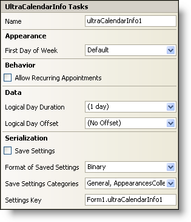

////

|metadata|
{
    "name": "wincalendarinfo-smart-tag",
    "controlName": ["WinCalendarInfo"],
    "tags": ["Getting Started"],
    "guid": "{2085150C-1DC1-4DD3-8654-38ABF3B7A6D5}",  
    "buildFlags": [],
    "createdOn": "0001-01-01T00:00:00Z"
}
|metadata|
////

= WinCalendarInfo Smart Tag

In Visual Studio 2005 (.NET Framework 2.0), each Infragistics Windows Forms control/component is equipped with a Smart Tag. By simply selecting the control/component, a Smart Tag anchor appears. When you click this anchor, a pop-up panel appears, providing you with quick and easy access to the most common properties and settings of the control/component.

The WinCalendarInfo™ Smart Tag contains the name of the component, as well as the following sections:

* Appearance -- Provides common tasks involving the appearance, look, and feel of the control.
* Behavior -- Provides easy access to properties that govern how the control behaves on the form.
* Data -- Refers to any underlying data the control is using such as data sources and data members.
* Serialization -- Provides quick access to properties used in the IPersistComponentSettings interface.

See below for a description of the item (e.g., field, drop-down list, checkbox) in each section, as well as the item's corresponding property in the properties grid.

[options="header", cols="a,a,a"]
|====
|Appearance|Description|Corresponding Property

|First Day of Week
|Select a day from the drop-down to identify what the first day of the week should be. The default value is what your current system settings are.
| pick:[win-forms="link:{ApiPlatform}win.ultrawinschedule{ApiVersion}~infragistics.win.ultrawinschedule.ultracalendarinfo~firstdayofweek.html[FirstDayOfWeek]"] 

|====

[options="header", cols="a,a,a"]
|====
|Behavior|Description|Corresponding Property

|Allow Recurring 

Appointments
|A recurring appointment is an appointment that repeats itself based on a certain pattern (e.g. daily, weekly, monthly, every other Friday, etc...). Select the check box to allow recurring appointments.
| pick:[win-forms="link:{ApiPlatform}win.ultrawinschedule{ApiVersion}~infragistics.win.ultrawinschedule.ultracalendarinfo~allowrecurringappointments.html[AllowRecurringAppointments]"] 

|====

[options="header", cols="a,a,a"]
|====
|Data|Description|Corresponding Property

|Logical Day Duration
|When you click the drop-down arrow, you will see a slider bar with a time display above it. Move the slider bar to indicate how long the day will be. The day can be no long than 24 hours and no less than one minute. You can also enter the hours and minutes with the keyboard.
| pick:[win-forms="link:{ApiPlatform}win.ultrawinschedule{ApiVersion}~infragistics.win.ultrawinschedule.ultracalendarinfo~logicaldayduration.html[LogicalDayDuration]"] 

|Logical Day Offset
|Typically, the beginning of the day is midnight (hour zero, minute zero). However, for some applications, it might be useful to consider the beginning of the day to be at some other time; this is where you can set that time. The offset can be no more than 23 hours, 59 minutes and no less than -23 hours, 59 minutes.
| pick:[win-forms="link:{ApiPlatform}win.ultrawinschedule{ApiVersion}~infragistics.win.ultrawinschedule.ultracalendarinfo~logicaldayoffset.html[LogicalDayOffset]"] 

|====

[options="header", cols="a,a,a"]
|====
|Serialization|Description|Corresponding Property

|Save Settings
|If you select this checkbox, the component will automatically load/save its property settings with the application's settings.
| pick:[win-forms="link:{ApiPlatform}win.ultrawinschedule{ApiVersion}~infragistics.win.ultrawinschedule.ultracalendarinfo~savesettings.html[SaveSettings]"] 

|Format of Saved Settings
|The component can save its settings in either binary or XML format.
| pick:[win-forms="link:{ApiPlatform}win.ultrawinschedule{ApiVersion}~infragistics.win.ultrawinschedule.ultracalendarinfo~savesettingsformat.html[SaveSettingsFormat]"] 

|Save Settings Categories
|This gives you the option of what categories in the calendar you would like to save. Click the drop-down list and you will see a list of categories with checkboxes next to them. Select the checkbox to save that specific category. Clear the checkbox if you do not want to save that information.
| pick:[win-forms="link:{ApiPlatform}win.ultrawinschedule{ApiVersion}~infragistics.win.ultrawinschedule.ultracalendarinfo~savesettingscategories.html[SaveSettingsCategories]"] 

|Settings Key
|You can specify the settings key that will be used to uniquely identify the settings' values that will be loaded/saved. By default, Visual Studio 2005 sets the settings key value based on the name of the containing form/control and the name of the component.
| pick:[win-forms="link:{ApiPlatform}win.ultrawinschedule{ApiVersion}~infragistics.win.ultrawinschedule.ultracalendarinfo~settingskey.html[SettingsKey]"] 

|====