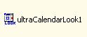

////

|metadata|
{
    "name": "wincalendarlook-about-wincalendarlook",
    "controlName": ["WinCalendarLook"],
    "tags": ["Scheduling","Styling"],
    "guid": "{DF83BC2D-6034-4176-98A9-E6E927900A79}",  
    "buildFlags": [],
    "createdOn": "0001-01-01T00:00:00Z"
}
|metadata|
////

= About WinCalendarLook

WinCalendarLook™ is a Windows Forms component that works the different views of the WinSchedule™ controls and components by providing the look and feel to all the views using one component. This lets you avoid having to set styles on each view.

* Appearance Support -- Full appearance support including alpha-blending, gradients, image, etc.
* Built-in theming -- Supports Standard, Office 2003, Visual Studio 2005 and Office 2007 themes.
* Holiday appearance -- Allows you to set a style to be used on all holidays, which are displayed in a view.

