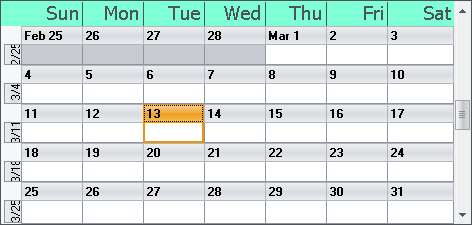

////

|metadata|
{
    "name": "wincalendarlook-assign-appearances-to-dayofweek-headers",
    "controlName": ["WinCalendarLook"],
    "tags": ["Scheduling","Styling"],
    "guid": "{7FC76C3C-0076-4E72-8227-4BDDF9B958FB}",  
    "buildFlags": [],
    "createdOn": "2005-07-07T00:00:00Z"
}
|metadata|
////

= Assign Appearances to DayOfWeek Headers

You may want to customize the  pick:[win-forms="link:{ApiPlatform}win.ultrawinschedule{ApiVersion}~infragistics.win.ultrawinschedule.dayofweek.html[DayOfWeek]"]  header for WinMonthViewSingle™. You can easily do this off WinMonthViewSingle's  pick:[win-forms="link:{ApiPlatform}win.ultrawinschedule{ApiVersion}~infragistics.win.ultrawinschedule.ultraschedulecontrolbase~calendarlook.html[CalendarLook]"]  object, as the following example code shows.

*In Visual Basic:*

----
Private Sub Assign_Appearances_to_DayOfWeek_Headers_Load( _
  ByVal sender As System.Object, _
  ByVal e As System.EventArgs) Handles MyBase.Load
	Me.UltraMonthViewSingle1.CalendarLook.DayOfWeekHeaderAppearance. _
	  FontData.Name = "Tahoma"
	Me.UltraMonthViewSingle1.CalendarLook.DayOfWeekHeaderAppearance. _
	  FontData.SizeInPoints = 14
	Me.UltraMonthViewSingle1.CalendarLook.DayOfWeekHeaderAppearance. _
	  TextHAlign = Infragistics.Win.HAlign.Right
	Me.UltraMonthViewSingle1.CalendarLook.DayOfWeekHeaderAppearance. _
	  BackColor = Color.Aquamarine
End Sub
----

*In C#:*

----
private void Assign_Appearances_to_DayOfWeek_Headers_Load( 
  object sender, EventArgs e)
{
	this.ultraMonthViewSingle1.CalendarLook.DayOfWeekHeaderAppearance.
	  FontData.Name = "Tahoma";
	this.ultraMonthViewSingle1.CalendarLook.DayOfWeekHeaderAppearance.
	  FontData.SizeInPoints = 14;
	this.ultraMonthViewSingle1.CalendarLook.DayOfWeekHeaderAppearance.
	  TextHAlign = Infragistics.Win.HAlign.Right;
	this.ultraMonthViewSingle1.CalendarLook.DayOfWeekHeaderAppearance.
	  BackColor = Color.Aquamarine;
}
----

If you add this code to a project with e WinMonthViewSingle and run it, you would see something similar to the following.

