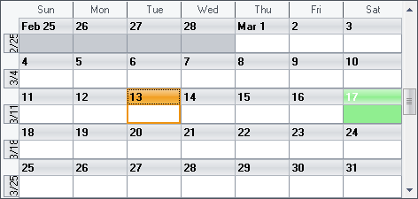

////

|metadata|
{
    "name": "wincalendarlook-assign-saved-appearances-to-holidays",
    "controlName": ["WinCalendarLook"],
    "tags": ["Scheduling","Styling"],
    "guid": "{9EF30B7D-0F16-4FD6-9D94-4ED2690CDB0A}",  
    "buildFlags": [],
    "createdOn": "2005-07-07T00:00:00Z"
}
|metadata|
////

= Assign Saved Appearances to Holidays

You can use the WinCalendarLook™ to assign appearances to specific holidays, and then assign those holidays specific dates on your calendar. The following steps walk you through the proceed of creating appearances for several popular U.S. holidays, and assigns the date that uses that appearance.

[start=1]
. On your form place a WinCalendarLook, and at least one of the WinSchedule™ views.
[start=2]
. Set the WinSchedule view's CalendarLook property to the form's instance of WinCalendarLook.
[start=3]
. Before you start writing any code, you should place using/imports directives in your code-behind so you don't need to always type out a member's fully qualified name.

*In Visual Basic:*

----
Imports Infragistics.Win.UltraWinSchedule
----

*In C#:*

----
using Infragistics.Win.UltraWinSchedule;
----

[start=4]
. In the code behind file create method called CreateAppearances. This method is where we will create the appearances for specific holidays.

*In Visual Basic:*

----
Private Sub CreateAppearances()
	Dim AP As Infragistics.Win.Appearance
	' Create an Appearance for each holiday
	AP = Me.UltraCalendarLook1.Appearances.Add("New Year's Day")
	AP.BackColor = Color.Yellow
	AP = Me.UltraCalendarLook1.Appearances.Add("St. Valentine's Day")
	AP.ForeColor = Color.White
	AP.BackColor = Color.Pink
	AP = Me.UltraCalendarLook1.Appearances.Add("St. Patrick's Day")
	AP.ForeColor = Color.White
	AP.BackColor = Color.LightGreen
	AP = Me.UltraCalendarLook1.Appearances.Add("Independence Day")
	AP.ForeColor = Color.Red
	AP.BackColor = Color.LightBlue
	AP = Me.UltraCalendarLook1.Appearances.Add("Halloween")
	AP.ForeColor = Color.Black
	AP.BackColor = Color.Orange
	AP = Me.UltraCalendarLook1.Appearances.Add("Christmas")
	AP.ForeColor = Color.Red
	AP.BackColor = Color.LightGreen
	AP = Me.UltraCalendarLook1.Appearances.Add("New Year's Eve")
	AP.BackColor = Color.LightYellow
End Sub
----

*In C#:*

----
private void CreateAppearances()
{
	Infragistics.Win.Appearance AP;
	// Create an Appearance for each holiday
	AP = this.ultraCalendarLook1.Appearances.Add("New Year's Day");
	AP.BackColor = Color.Yellow;
	AP = this.ultraCalendarLook1.Appearances.Add("St. Valentine's Day");
	AP.ForeColor = Color.White;
	AP.BackColor = Color.Pink;
	AP = this.ultraCalendarLook1.Appearances.Add("St. Patrick's Day");
	AP.ForeColor = Color.White;
	AP.BackColor = Color.LightGreen;
	AP = this.ultraCalendarLook1.Appearances.Add("Independence Day");
	AP.ForeColor = Color.Red;
	AP.BackColor = Color.LightBlue;
	AP = this.ultraCalendarLook1.Appearances.Add("Halloween");
	AP.ForeColor = Color.Black;
	AP.BackColor = Color.Orange;
	AP = this.ultraCalendarLook1.Appearances.Add("Christmas");
	AP.ForeColor = Color.Red;
	AP.BackColor = Color.LightGreen;
	AP = this.ultraCalendarLook1.Appearances.Add("New Year's Eve");
	AP.BackColor = Color.LightYellow;
}
----

[start=5]
. In the form's Load event place the following example code. This is where we assign the holiday appearances to the specific date that they apply to.

*In Visual Basic:*

----
Private Sub Assign_Saved_Appearances_to_Holidays_Load( _
  ByVal sender As System.Object, _
  ByVal e As System.EventArgs) Handles MyBase.Load
	CreateAppearances()
	Me.UltraCalendarLook1.DaysOfYearLook(YearMonthEnum.January, 1).Appearance = _
	  Me.UltraCalendarLook1.Appearances("New Year's Day")
	Me.UltraCalendarLook1.DaysOfYearLook(YearMonthEnum.February, 14).Appearance = _
	  Me.UltraCalendarLook1.Appearances("St. Valentine's Day")
	Me.UltraCalendarLook1.DaysOfYearLook(YearMonthEnum.March, 17).Appearance = _
	  Me.UltraCalendarLook1.Appearances("St. Patrick's Day")
	Me.UltraCalendarLook1.DaysOfYearLook(YearMonthEnum.July, 4).Appearance = _
	  Me.UltraCalendarLook1.Appearances("Independence Day")
	Me.UltraCalendarLook1.DaysOfYearLook(YearMonthEnum.October, 31).Appearance = _
	  Me.UltraCalendarLook1.Appearances("Halloween")
	Me.UltraCalendarLook1.DaysOfYearLook(YearMonthEnum.December, 25).Appearance = _
	  Me.UltraCalendarLook1.Appearances("Christmas")
	Me.UltraCalendarLook1.DaysOfYearLook(YearMonthEnum.December, 31).Appearance = _
	  Me.UltraCalendarLook1.Appearances("New Year's Eve")
End Sub
----

*In C#:*

----
private void Assign_Saved_Appearances_to_Holidays_Load( 
  object sender, EventArgs e)
{
	this.CreateAppearances();
	this.ultraCalendarLook1.DaysOfYearLook
	  [(int)YearMonthEnum.January, 1].Appearance =
	  this.ultraCalendarLook1.Appearances["New Year's Day"];
	this.ultraCalendarLook1.DaysOfYearLook
	  [(int)YearMonthEnum.February, 14].Appearance =
	  this.ultraCalendarLook1.Appearances["St. Valentine's Day"];
	this.ultraCalendarLook1.DaysOfYearLook
	  [(int)YearMonthEnum.March, 17].Appearance =
	  this.ultraCalendarLook1.Appearances["St. Patrick's Day"];
	this.ultraCalendarLook1.DaysOfYearLook
	  [(int)YearMonthEnum.July, 4].Appearance =
	  this.ultraCalendarLook1.Appearances["Independence Day"];
	this.ultraCalendarLook1.DaysOfYearLook
	  [(int)YearMonthEnum.October, 31].Appearance =
	  this.ultraCalendarLook1.Appearances["Halloween"];
	this.ultraCalendarLook1.DaysOfYearLook
	  [(int)YearMonthEnum.December, 25].Appearance =
	  this.ultraCalendarLook1.Appearances["Christmas"];
	this.ultraCalendarLook1.DaysOfYearLook
	  [(int)YearMonthEnum.December, 31].Appearance =
	  this.ultraCalendarLook1.Appearances["New Year's Eve"];
}
----

[start=6]
. Build and run the project. Move around in the WinSchedule view to the months that have a holiday to see the appearance being applied.

