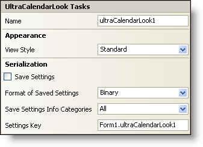

////

|metadata|
{
    "name": "wincalendarlook-smart-tag",
    "controlName": ["WinCalendarLook"],
    "tags": ["API"],
    "guid": "{BB4A23FA-DCCF-4B5D-81C3-E2BAA15B65C7}",  
    "buildFlags": [],
    "createdOn": "0001-01-01T00:00:00Z"
}
|metadata|
////

= WinCalendarLook Smart Tag

In Visual Studio 2005 (.NET Framework 2.0), each Infragistics Windows Forms control/component is equipped with a Smart Tag. By simply selecting the control/component, a Smart Tag anchor appears. When you click this anchor, a pop-up panel appears, providing you with quick and easy access to the most common properties and settings of the control/component.

The WinCalendarLook™ Smart Tag contains the name of the component, as well as the following sections:

* Appearance -- Provides common tasks involving the appearance, look, and feel of the control.
* Serialization -- Provides quick access to properties used in the IPersistComponentSettings interface.

See below for a description of the item (e.g., field, drop-down list, checkbox) in each section, as well as the item's corresponding property in the properties grid.

[options="header", cols="a,a,a"]
|====
|Appearance|Description|Corresponding Property

|View Style
|Change the look of WinSchedule to Office 2003, Visual Studio 2005, Office 2007.
| pick:[win-forms="link:{ApiPlatform}win.ultrawinschedule.v{ProductVersion}~infragistics.win.ultrawinschedule.ultracalendarlook~viewstyle.html[ViewStyle]"] 

|====

[options="header", cols="a,a,a"]
|====
|Serialization|Description|Corresponding Property

|Save Settings
|If you select this checkbox, the component will automatically load/save its property settings with the application's settings.
| pick:[win-forms="link:infragistics4.win.ultrawinschedule.v{ProductVersion}~infragistics.win.ultrawinschedule.ultracalendarlook~savesettings.html[SaveSettings]"] 

|Format of Saved Settings
|The component can save its settings in either binary or XML format.
| pick:[win-forms="link:infragistics4.win.ultrawinschedule.v{ProductVersion}~infragistics.win.ultrawinschedule.ultracalendarlook~savesettingsformat.html[SaveSettingsFormat]"] 

|Save Settings Info 

Categories
|This gives you the option of what categories in the calendar you would like to save. Click the drop-down list and you will see a list of categories with checkboxes next to them. Select the checkbox to save that specific category. Clear the checkbox if you do not want to save that information.
| pick:[win-forms="link:infragistics4.win.ultrawinschedule.v{ProductVersion}~infragistics.win.ultrawinschedule.ultracalendarlook~savesettingsinfocategories.html[SaveSettingsInfoCategories]"] 

|Settings Key
|You can specify the settings key that will be used to uniquely identify the settings' values that will be loaded/saved. By default, Visual Studio 2005 sets the settings key value based on the name of the containing form/control and the name of the component.
| pick:[win-forms="link:infragistics4.win.ultrawinschedule.v{ProductVersion}~infragistics.win.ultrawinschedule.ultracalendarlook~settingskey.html[SettingsKey]"] 

|====